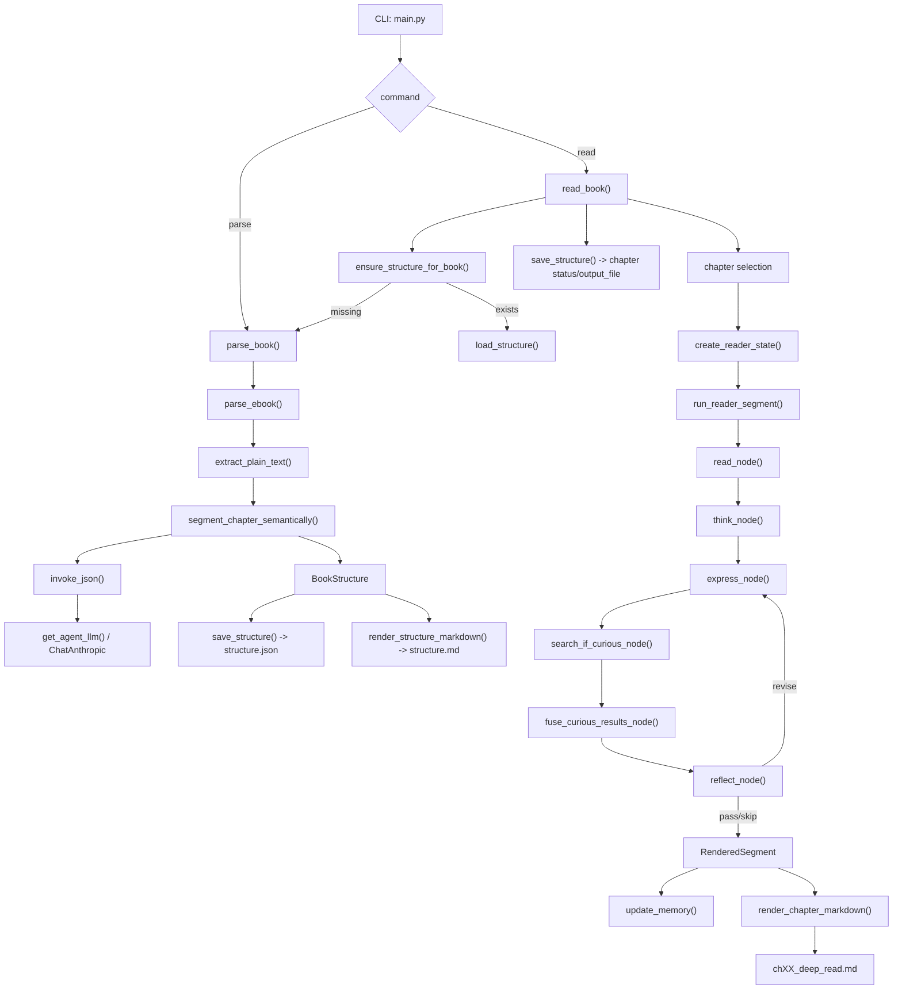

# 项目体检报告（Step 1：结构扫描）

- 扫描日期：2026-03-04
- 扫描范围：整个仓库当前工作区
- 扫描方式：静态代码阅读 + 目录遍历 + `python3 -m pytest`
- 结论摘要：
  - 当前真正跑通的主链路是 `main.py -> src/iterator_reader/*` 的 `parse/read` 双命令 CLI，不是设计文档里那条完整的 `Plan-and-Execute + ReAct` 组合图。
  - 项目里同时存在两套架构：一套是当前主用的 `Iterator-Reader` 实现，另一套是 `src/graph/* + src/analyzer/*` 的 LangGraph 原型/备用实现。
  - `python3 -m pytest` 在当前环境下通过，结果为 `26 passed`。
  - 当前环境 Python 为 `3.9.6`，但项目声明要求 `>=3.11`，存在环境与声明不一致风险。
  - 设计稿中“金句扩展网络 / 背景补充 / 跨章聚合 / LangSmith Trace”并未全部进入当前 CLI 主链路。

## 1. 项目目录结构树

说明：以下尽量逐项列出仓库内现有文件与目录；源码文件按职责说明，数据/缓存/样本文件按工件性质说明。

```text
reading-companion/ - 项目根目录，包含 CLI、源码、测试、样本数据、分析报告和输出工件。
├── .DS_Store - macOS Finder 元数据，无业务作用。
├── .claude/ - Claude 本地配置目录，不参与应用运行。
│   ├── settings.json - Claude 通用设置文件。
│   └── settings.local.json - Claude 本地覆盖设置文件。
├── .env - 本地环境变量文件，用于放置 LLM/Tavily 密钥与模型配置。
├── .env.example - 环境变量模板，说明需要的 LLM/Tavily 配置项。
├── .gitignore - Git 忽略规则。
├── .pytest_cache/ - pytest 运行缓存目录。
│   ├── .gitignore - pytest 缓存忽略规则。
│   ├── CACHEDIR.TAG - pytest 缓存标记文件。
│   ├── README.md - pytest 缓存说明文件。
│   └── v/ - pytest 版本化缓存目录。
│       └── cache/ - pytest 缓存内容目录。
│           ├── lastfailed - 上次失败用例缓存。
│           └── nodeids - 已收集测试节点缓存。
├── AGENTS.md - 仓库级 Agent 指令，定义产品定位、设计意图与代码规范。
├── analysis_reports/ - 项目分析报告目录，存放结构扫描、亮点提炼和后续 Gap 检查。
│   ├── step1_project_health_report.md - Step 1 项目体检报告。
│   ├── step2_resume_highlights.md - Step 2 面向简历的亮点提炼报告。
│   └── step3_gap_check.md - Step 3 Gap 检查与后续补齐建议。
├── data/ - 样本输入数据目录。
│   ├── .DS_Store - macOS Finder 元数据，无业务作用。
│   ├── .gitkeep - 保持空目录被 Git 跟踪。
│   ├── The Value of Others-user personal highlight.md - 人类高亮样本，用于评测对比。
│   ├── The Value of Others.epub - 已解包的 EPUB 目录样本，用于分析原书结构。
│   │   ├── META-INF/ - EPUB 元信息目录。
│   │   │   └── container.xml - EPUB 容器入口描述文件。
│   │   ├── OEBPS/ - EPUB 主内容目录。
│   │   │   ├── content.opf - EPUB 清单与元数据主文件。
│   │   │   ├── font_rsrc1NA.ttf - EPUB 内嵌字体资源 1。
│   │   │   ├── font_rsrc1NB.ttf - EPUB 内嵌字体资源 2。
│   │   │   ├── image_rsrc1NC.jpg - EPUB 图片资源 1。
│   │   │   ├── image_rsrc1ND.jpg - EPUB 图片资源 2。
│   │   │   ├── image_rsrc1NE.jpg - EPUB 图片资源 3。
│   │   │   ├── image_rsrc1NF.jpg - EPUB 图片资源 4。
│   │   │   ├── image_rsrc1NG.jpg - EPUB 图片资源 5。
│   │   │   ├── image_rsrc1NH.jpg - EPUB 图片资源 6。
│   │   │   ├── nav.xhtml - EPUB 导航文档。
│   │   │   ├── part0000.xhtml - 样本书正文切片 0。
│   │   │   ├── part0001.xhtml - 样本书正文切片 1。
│   │   │   ├── part0002.xhtml - 样本书正文切片 2。
│   │   │   ├── part0003.xhtml - 样本书正文切片 3。
│   │   │   ├── part0004.xhtml - 样本书正文切片 4。
│   │   │   ├── part0005.xhtml - 样本书正文切片 5。
│   │   │   ├── part0006.xhtml - 样本书正文切片 6。
│   │   │   ├── part0007.xhtml - 样本书正文切片 7。
│   │   │   ├── part0008.xhtml - 样本书正文切片 8。
│   │   │   ├── part0009.xhtml - 样本书正文切片 9。
│   │   │   ├── part0010.xhtml - 样本书正文切片 10。
│   │   │   ├── part0011.xhtml - 样本书正文切片 11。
│   │   │   ├── part0012.xhtml - 样本书正文切片 12。
│   │   │   ├── part0013.xhtml - 样本书正文切片 13。
│   │   │   ├── part0014.xhtml - 样本书正文切片 14。
│   │   │   ├── part0015.xhtml - 样本书正文切片 15。
│   │   │   ├── part0016.xhtml - 样本书正文切片 16。
│   │   │   ├── part0017.xhtml - 样本书正文切片 17。
│   │   │   ├── part0018.xhtml - 样本书正文切片 18。
│   │   │   ├── part0019.xhtml - 样本书正文切片 19。
│   │   │   ├── part0020.xhtml - 样本书正文切片 20。
│   │   │   ├── stylesheet.css - 样本 EPUB 样式表。
│   │   │   └── toc.ncx - EPUB 目录导航文件。
│   │   ├── mimetype - EPUB MIME 类型声明。
│   │   └── oceanofpdf.com - 样本书来源标记文件。
│   └── The Value of Others.repacked.epub - 重新打包后的 EPUB 样本。
├── eval/ - 评测与诊断脚本目录。
│   ├── __init__.py - 评测目录包初始化文件。
│   ├── compare_highlights.py - 对比人类高亮与 Agent 输出、诊断遗漏原因的主脚本。
│   ├── highlight_comparison_ch1.md - 第 1 章高亮对比评测报告样本。
│   ├── highlight_comparison_ch2.md - 第 2 章高亮对比评测报告样本。
│   ├── highlight_comparison_ch3.md - 第 3 章高亮对比评测报告样本。
│   ├── highlight_comparison_ch3_before_prompt_tuning.md - Prompt 调优前的第 3 章对比报告。
│   └── judge.py - LLM-as-Judge 金句扩展质量评分脚本。
├── main.py - 当前 CLI 入口，提供 `parse` 与 `read` 两个命令。
├── output/ - 运行输出与历史实验工件目录。
│   ├── .DS_Store - macOS Finder 元数据，无业务作用。
│   ├── .gitkeep - 保持输出目录被 Git 跟踪。
│   ├── chapter1.md - 早期章节输出样本。
│   ├── chapter1_analysis.md - 早期章节分析样本。
│   ├── chapter1_analysis_v2.md - 章节分析第二版样本。
│   ├── chapter1_v3.md - 章节输出第三版样本。
│   ├── notes.epub - 生成阅读笔记的 EPUB 样本。
│   ├── notes_extracted/ - `notes.epub` 解包后的检查目录。
│   │   ├── EPUB/ - 输出 EPUB 正文目录。
│   │   │   ├── content.opf - 输出 EPUB 清单文件。
│   │   │   ├── nav.xhtml - 输出 EPUB 导航页面。
│   │   │   ├── notes.xhtml - 输出 EPUB 笔记正文页面。
│   │   │   ├── structure.xhtml - 输出 EPUB 思想结构图页面。
│   │   │   └── toc.ncx - 输出 EPUB 目录文件。
│   │   ├── META-INF/ - 输出 EPUB 元数据目录。
│   │   │   └── container.xml - 输出 EPUB 容器描述。
│   │   └── mimetype - 输出 EPUB MIME 类型声明。
│   ├── the-value-of-others-understanding-the-economic-model-of-relationships-to-get-and-keep-more-of-what-you-want-in-the-sexual-marketplace/ - 当前 Iterator-Reader 样本书的正式输出目录。
│   │   ├── .DS_Store - macOS Finder 元数据，无业务作用。
│   │   ├── ch01_deep_read.md - 第 1 章深读输出。
│   │   ├── ch02_deep_read.md - 第 2 章深读输出。
│   │   ├── ch03_deep_read.md - 第 3 章深读输出。
│   │   ├── ch03_deep_read_before_prompt_tuning.md - Prompt 调优前的第 3 章深读样本。
│   │   ├── ch04_deep_read.md - 第 4 章深读输出。
│   │   ├── ch10_deep_read.md - 第 10 章深读输出。
│   │   ├── legacy/ - 旧命名或旧流程遗留输出目录。
│   │   │   └── ch16_deep_read.md - 旧版深读输出样本。
│   │   ├── part06_prologue_deep_read.md - 非编号章节/前言的深读输出。
│   │   ├── structure.json - 书籍结构、语义分段与章节状态持久化文件。
│   │   └── structure.md - `structure.json` 的可读 Markdown 视图。
│   ├── value-of-others-ch7-refactor.md - 第 7 章重构版输出样本。
│   └── value-of-others-ch7.md - 第 7 章输出样本。
├── pyproject.toml - 项目包配置、依赖声明与 Ruff 配置。
├── src/ - 应用源码目录。
│   ├── __init__.py - 包版本导出文件。
│   ├── agents/ - 生成后验证（Generate-then-Verify）能力封装。
│   │   ├── __init__.py - 导出金句扩展、背景补充与 LLM 辅助函数。
│   │   └── generate_then_verify.py - 金句扩展/背景补充生成与搜索验证核心实现。
│   ├── analyzer/ - 旧版章节级/整书级分析模块。
│   │   ├── __init__.py - 导出章节分析与整书分析接口。
│   │   ├── chapter.py - 章节金句抽取、扩展、背景补充和洞见生成。
│   │   └── holistic.py - 跨章节整体分析与思想结构概览生成。
│   ├── config.py - 统一读取 `.env` 中的 LLM 与 Tavily 配置。
│   ├── graph/ - LangGraph 风格的内外层图原型实现。
│   │   ├── __init__.py - 图模块包说明。
│   │   ├── inner.py - 内层 Generate-then-Verify 图原型。
│   │   ├── main.py - 图组合入口与异步 `run_agent` 包装。
│   │   ├── outer.py - 外层 Plan-and-Execute 图原型。
│   │   └── state.py - 图状态、章节结果与结构化类型定义。
│   ├── iterator_reader/ - 当前主线的 Parse + Iterator + Reader 实现。
│   │   ├── __init__.py - 导出 parse/read 公共入口。
│   │   ├── iterator.py - 外层章节遍历器、章节选择与 checkpoint 写入。
│   │   ├── language.py - 书籍语言检测与多语言标签辅助。
│   │   ├── llm_utils.py - Reader/parse 阶段的 JSON 调用与响应解析工具。
│   │   ├── markdown.py - 章节深读结果的 Markdown 渲染器。
│   │   ├── models.py - `structure.json`、ReaderState、Reaction 等类型定义。
│   │   ├── parse.py - 解析书籍结构、LLM 语义分段与 `structure.json` 生成。
│   │   ├── reader.py - 内层 Reader 循环：Read/Think/Express/Search/Reflect。
│   │   ├── storage.py - 输出目录、文件名、结构文件读写等存储工具。
│   │   └── structure_markdown.py - 结构总览 Markdown 渲染器。
│   ├── parsers/ - 多格式电子书解析与输出写入工具。
│   │   ├── __init__.py - 导出解析器与写出器接口。
│   │   ├── ebook_parser.py - EPUB/PDF/MOBI/TXT 解析器。
│   │   └── epub_writer.py - 将阅读笔记写为 EPUB/Markdown 的工具。
│   ├── prompts/ - Prompt 模板目录。
│   │   ├── __init__.py - Prompt 包说明。
│   │   └── templates.py - 所有 Prompt 常量：分段、Reader、扩展、验证、聚合等。
│   └── tools/ - 外部工具封装目录。
│       ├── __init__.py - 工具包说明。
│       └── search.py - Tavily 搜索工具封装与兼容接口。
├── tests/ - 单元测试与回归测试目录。
│   ├── __init__.py - 测试包初始化文件。
│   ├── test_compare_highlights.py - 高亮对比解析与匹配规则测试。
│   ├── test_iterator_markdown.py - 章节 Markdown 渲染测试。
│   ├── test_iterator_parse.py - `structure.json` 与分段持久化测试。
│   ├── test_iterator_prompts.py - Prompt 约束回归测试。
│   ├── test_iterator_reader.py - Reader 内存、搜索、反思与进度提示测试。
│   └── test_iterator_selection.py - 章节选择、输出命名与段落显示编号测试。
```

## 2. 核心模块调用关系

### 2.1 当前实际生效的主调用链

当前用户可直接运行的入口只有 `main.py`，并且它只接到了 `src.iterator_reader` 这一套实现：

- `python main.py parse <book>`：
  - `main.py:52-63` 调 `parse_book`
  - `src/iterator_reader/parse.py:390-392` 调 `build_structure`
  - `build_structure` 内部：
    - `src/parsers/ebook_parser.py` 解析 EPUB/PDF/MOBI/TXT
    - `extract_plain_text` 做正文净化
    - `segment_chapter_semantically` 用 LLM 做语义分段
    - `save_structure` 写 `structure.json`
    - `render_structure_markdown` 写 `structure.md`

- `python main.py read <book>`：
  - `main.py:66-84` 调 `read_book`
  - `src/iterator_reader/iterator.py:68-131`：
    - 先 `ensure_structure_for_book`
    - 根据 `--chapter` / `--continue` 选择章节
    - 为每个语义单元创建 `ReaderState`
    - 调 `run_reader_segment`
    - 收集 `RenderedSegment`
    - `render_chapter_markdown` 输出章节 Markdown
    - 更新 `structure.json` 中章节状态与输出文件名

### 2.2 当前实际数据流



### 2.3 入口文件到各阶段的调用链

#### Parse 阶段

1. `main.py:52-63` `cmd_parse`
2. `src/iterator_reader/parse.py:390-392` `parse_book`
3. `src/iterator_reader/parse.py:333-387` `build_structure`
4. `src/parsers/ebook_parser.py:27-43` `parse_ebook`
5. `src/iterator_reader/parse.py:279-330` `segment_chapter_semantically`
6. `src/iterator_reader/llm_utils.py:57-68` `invoke_json`
7. `src/agents/generate_then_verify.py:62-72` `get_agent_llm`
8. `src/iterator_reader/storage.py:102-112` 持久化 `structure.json`

#### Read 阶段

1. `main.py:66-84` `cmd_read`
2. `src/iterator_reader/iterator.py:68-131` `read_book`
3. `src/iterator_reader/parse.py:395-416` `ensure_structure_for_book`
4. `src/iterator_reader/iterator.py:100-109` `create_reader_state` + `run_reader_segment`
5. `src/iterator_reader/reader.py:899-920` 手工执行 Reader 循环
6. `src/iterator_reader/reader.py:484-508` `think_node`
7. `src/iterator_reader/reader.py:511-535` `express_node`
8. `src/iterator_reader/reader.py:538-586` `search_if_curious_node`
9. `src/iterator_reader/reader.py:624-630` `fuse_curious_results_node`
10. `src/iterator_reader/reader.py:633-682` `reflect_node`
11. `src/iterator_reader/markdown.py:67-118` `render_chapter_markdown`
12. `src/iterator_reader/storage.py:102-112` 回写 `structure.json`

### 2.4 仓库内另一条“原型链路”（当前未接入 CLI）

仓库还保留了一套 LangGraph 原型：

- `src/graph/main.py:22-37` 试图组合 `outer_graph + inner_graph`
- `src/graph/outer.py` 定义 `plan -> execute -> aggregate`
- `src/graph/inner.py` 定义 `think -> act -> observe`
- `src/analyzer/chapter.py` / `src/analyzer/holistic.py` 提供章节/整书分析函数

但当前 `main.py` 并不调用 `src.graph.main.run_agent`，因此这套图不是 CLI 主链路。

### 2.5 架构健康观察

- `src/graph/main.py:30-37` 虽然构造了 `inner_graph`，但最终直接 `return outer_graph`，没有真正把内层图接进外层图。
- `src/graph/outer.py:343-355` 中 `replan` 节点没有任何入边，属于死节点。
- `src/iterator_reader/reader.py:693-716` 定义了 `build_reader_graph()`，但 `src/iterator_reader/iterator.py:109` 实际调用的是 `run_reader_segment()` 的手工节点循环，不是编译后的 LangGraph。

## 3. 技术栈清单

### 3.1 Python 与构建

| 项 | 声明/观察 | 用途 |
|---|---|---|
| Python | `pyproject.toml:5` 声明 `>=3.11`；当前运行环境实测为 `3.9.6` | 运行项目代码与测试 |
| Hatchling | `pyproject.toml:27-29` | 构建后端 |
| Ruff target | `pyproject.toml:31-32` `py311` | 代码风格目标版本 |

### 3.2 依赖清单（声明 + 当前环境版本）

| 依赖 | `pyproject` 声明 | 当前环境版本 | 用途 | 代码证据 |
|---|---|---:|---|---|
| `langgraph` | `>=0.2.0` | `0.6.11` | 定义 StateGraph；用于 Reader/原型图 | `src/iterator_reader/reader.py:10`, `src/graph/inner.py:11`, `src/graph/outer.py:14` |
| `langchain` | `>=0.3.0` | `0.3.27` | `SystemMessage/HumanMessage` 等消息对象 | `src/iterator_reader/llm_utils.py:9`, `src/agents/generate_then_verify.py:9`, `src/analyzer/chapter.py:9` |
| `langchain-core` | `>=0.3.0` | `0.3.83` | `@tool` 装饰器与工具协议 | `src/tools/search.py:5` |
| `langchain-community` | `>=0.3.0` | `0.3.31` | 当前代码中未发现直接使用 | 仓库搜索仅在 `pyproject.toml:10` 出现 |
| `langchain-anthropic` | `>=0.3.0` | `0.3.22` | 通过 Anthropic-compatible 接口接入模型 | `src/agents/generate_then_verify.py:10`, `src/graph/outer.py:13`, `eval/compare_highlights.py:20`, `eval/judge.py:16` |
| `tavily-python` | `>=0.3.0` | `0.7.22` | 联网搜索，用于验证与 Reader 好奇搜索 | `src/tools/search.py:6` |
| `pydantic` | `>=2.0` | `2.12.5` | 当前源码未直接使用 | 代码搜索未见直接导入 |
| `python-dotenv` | `>=1.0` | `1.2.1` | 从 `.env` 加载配置 | `src/config.py:6-9` |
| `ebooklib` | `>=0.5` | `0.20` | EPUB 解析与 EPUB 写出 | `src/parsers/ebook_parser.py:10-11`, `src/parsers/epub_writer.py:6` |
| `pymupdf` | `>=1.23` | `1.26.5` | PDF 解析 | `src/parsers/ebook_parser.py:12` |
| `mobi` | `>=0.3` | `0.4.1` | MOBI/AZW 解析 | `src/parsers/ebook_parser.py:15-18` |
| `pytest` | `>=8.0` | `8.4.2` | 测试运行 | `python3 -m pytest` 实测 |
| `pytest-asyncio` | `>=0.23` | 未安装 | 预期开发依赖，目前环境缺失 | `pyproject.toml:21-24` |
| `ruff` | `>=0.4` | 未安装 | 预期静态检查依赖，目前环境缺失 | `pyproject.toml:21-24` |

### 3.3 环境里额外观察到、但项目未正式接入的包

| 依赖 | 当前环境版本 | 说明 |
|---|---:|---|
| `langsmith` | `0.4.37` | 环境中已安装，但仓库代码未发现任何 LangSmith Trace/Eval 接入代码；设计文档有提到，实际实现缺失。 |
| `anyio` | `4.12.1` | pytest 插件运行时依赖。 |
| `pluggy` | `1.6.0` | pytest 运行时依赖。 |

### 3.4 LLM 接入方式

#### 当前主线接法

- 配置来源：
  - `src/config.py:12-23` 读取 `LLM_BASE_URL / LLM_API_KEY / LLM_MODEL`
  - `src/config.py:20` 默认 `base_url` 为 `https://api.minimaxi.chat/v1`
  - `.env.example` 说明这是一个 “Anthropic-compatible API for Minimax”

- SDK/协议：
  - 使用 `langchain_anthropic.ChatAnthropic`
  - 实际上是“Anthropic 兼容格式 + 自定义 `base_url`”而不是硬绑 Anthropic 官方端点

- 调用模式：
  - `src/iterator_reader/llm_utils.py:57-68` 与 `src/agents/generate_then_verify.py:128-137` 用 `SystemMessage + HumanMessage` 调模型
  - Prompt 以 JSON 输出为主，随后用本地 JSON 提取器解析

- 参数差异：
  - Reader / Generate-then-Verify 主线：`temperature=0.2`, `max_tokens=4096`, `timeout=120`，见 `src/agents/generate_then_verify.py:62-72`
  - 旧版外层图：`temperature=0.7`，见 `src/graph/outer.py:33-41`

#### 模型名状态

- 仓库没有写死模型名，依赖环境变量 `LLM_MODEL`
- 如果环境未配置，默认值是 `default-model`，见 `src/config.py:19-23`
- 这意味着“实际模型”不是仓库静态可知信息，而是部署/本地环境决定

### 3.5 搜索工具接入

- `src/tools/search.py:19-52` 用 `TavilyClient` 封装 `search_web`
- `src/config.py:26-32` 读取 `TAVILY_API_KEY`
- 两处主要消费：
  - `src/agents/generate_then_verify.py:184-196` 做验证搜索
  - `src/iterator_reader/reader.py:391-393` 做 Reader 的 curiosity 搜索

### 3.6 本次基础健康检查结果

- 命令：`python3 -m pytest`
- 结果：`26 passed`
- 当前测试环境：`Python 3.9.6`, `pytest 8.4.2`
- 警告：
  - `urllib3` 对 `LibreSSL 2.8.3` 的兼容警告
  - `PyMuPDF` 相关 `SwigPy*` deprecation warning

## 4. 与设计文档的差异对照

### 4.1 Parse→Read 两阶段

- 状态：✅ 已实现
- 实际实现：
  - `main.py:52-63` `parse` 命令
  - `main.py:66-84` `read` 命令
  - `src/iterator_reader/parse.py:390-392` `parse_book`
  - `src/iterator_reader/iterator.py:68-131` `read_book`
- 说明：
  - 当前产品主线明确区分“先生成结构，再逐章深读”。
  - `read` 阶段还支持 `ensure_structure_for_book()` 自动补齐 parse 结果。

### 4.2 LLM 语义分段

- 状态：✅ 已实现
- 实际实现：
  - `src/iterator_reader/parse.py:279-330` `segment_chapter_semantically`
  - 使用 `SEMANTIC_SEGMENTATION_SYSTEM/PROMPT`
  - 通过 `invoke_json()` 调模型，按段落区间生成语义单元
- 说明：
  - 这不是纯规则切分；只有在模型结果失真时，才回落到 `_compact_segments()` / `_fallback_chunk_segments()` / `fallback_segments()`。

### 4.3 Iterator-Reader 双层架构

- 状态：✅ 已实现
- 实际实现：
  - 外层 Iterator：`src/iterator_reader/iterator.py:68-131`
  - 内层 Reader：`src/iterator_reader/reader.py:438-920`
- 说明：
  - 外层负责章节选择、进度、checkpoint、文件输出，不直接调 LLM。
  - 内层负责 `Think / Express / Search / Reflect`，所有模型调用都在 Reader 内部发生。

### 4.4 Read-Think-Express-Reflect 四步循环

- 状态：✅ 已实现
- 实际实现：
  - `read_node()`：`src/iterator_reader/reader.py:468-481`
  - `think_node()`：`src/iterator_reader/reader.py:484-508`
  - `express_node()`：`src/iterator_reader/reader.py:511-535`
  - `reflect_node()`：`src/iterator_reader/reader.py:633-682`
  - 额外插入了 `search_if_curious_node()` 与 `fuse_curious_results_node()`
- 说明：
  - 实际比设计多了一段“好奇即搜，再把结果融回表达”的子流程。

### 4.5 Reflection 自评

- 状态：✅ 已实现
- 实际实现：
  - `src/iterator_reader/models.py:12-13` 定义 `ReaderDecision = pass|revise|skip`
  - `src/iterator_reader/reader.py:396-435` `_normalize_reflection`
  - `src/iterator_reader/reader.py:659-677` revise 分支
  - `src/iterator_reader/reader.py:685-690` `should_continue_reader`
- 说明：
  - 支持 `pass / revise / skip`
  - `revise` 会回到 `express`
  - 超过最大修改次数会自动降为 `skip`

### 4.6 金句扩展网络

- 状态：⚠️ 部分实现
- 实际实现：
  - `src/agents/generate_then_verify.py:358-385` `generate_quote_expansion`
  - `src/graph/inner.py:70-78` 可调用金句扩展
  - `src/analyzer/chapter.py:119-125` 章节分析里会给 quote 增加 expansion
- 差异：
  - 当前 CLI 主链路 `main.py -> iterator_reader` 并不会调用这套“金句扩展网络”。
  - 真实运行输出目前是“逐语义单元的 Reader reactions”，不是“从书中金句出发的扩展网络成品”。

### 4.7 Generate-then-Verify

- 状态：⚠️ 部分实现
- 实际实现：
  - 金句：`src/agents/generate_then_verify.py:358-385`
  - 背景：`src/agents/generate_then_verify.py:388-437`
  - 验证：`verify_quote_candidate()` / `verify_background_candidate()`
- 差异：
  - 该模式确实被实现了，但主要存在于 `agents/`、`graph/inner.py`、`analyzer/chapter.py`。
  - 当前主用 Reader 路径不是这套逻辑；Reader 的 `curious` 是“先有问题 -> 搜索 -> 融回表达”，不是“先生成候选 -> 再验证归因”。

### 4.8 背景补充

- 状态：⚠️ 部分实现
- 实际实现：
  - `src/agents/generate_then_verify.py:388-437` `generate_background_knowledge`
  - `src/graph/inner.py:58-68` 背景补充原型
  - `src/analyzer/chapter.py:127-133` 章节分析里会生成背景
- 差异：
  - 当前 CLI 深读输出没有结构化“背景补充”模块。
  - Reader 有搜索补充，但它被折叠进 `curious` reaction，而不是单独产出“理论/人物/历史背景”段落。

### 4.9 角色 + 工具箱深度控制

- 状态：✅ 已实现
- 实际实现：
  - Prompt：`src/prompts/templates.py:418-614`
  - 类型：`src/iterator_reader/models.py:13`, `ReactionType`
  - 渲染：`src/iterator_reader/markdown.py:11-18`
  - 测试：`tests/test_iterator_prompts.py`, `tests/test_iterator_markdown.py`
- 说明：
  - 六类工具箱都在 Prompt 和输出层面落地：`💡 / ✍️ / 🔍 / ⚡ / 🔗 / 🤫`
  - 控制方式是 Prompt 约束 + 反思筛选，不是单独的策略控制器。

### 4.10 Checkpoint 容错 / 断点续读

- 状态：✅ 已实现
- 实际实现：
  - `src/iterator_reader/iterator.py:89-128` 章节开始前写 `in_progress`，完成后写 `done`，异常时回滚为 `pending`
  - `main.py:108-112` 提供 `--continue`
  - `src/iterator_reader/iterator.py:46-47` 在 continue 模式下跳过已完成章节
  - `structure.json` 保存状态，见 `src/iterator_reader/storage.py:102-112`
- 说明：
  - 这是“章节级 checkpoint”，不是“语义单元级 checkpoint”。
  - 崩溃后可以从未完成章节续跑，但章节内中断不会从具体 segment 恢复。

### 4.11 阅读记忆（LangGraph State）

- 状态：🔀 实现方式不同
- 实际实现：
  - `src/iterator_reader/models.py:50-56` `ReaderMemory`
  - `src/iterator_reader/iterator.py:86` 初始化内存
  - `src/iterator_reader/iterator.py:111` 每段后 `update_memory`
  - `src/iterator_reader/reader.py:850-896` 更新与初始化记忆
- 实际做法 vs 设计意图：
  - 实际上有“跨段关联的状态管理”，但它是手工维护的 Python dict，不是持久化的 LangGraph state machine。
  - 这份记忆只存在于当前 `read_book()` 运行期间；如果用 `--continue` 新开一次进程，已完成章节的阅读记忆不会从历史输出重建。

### 4.12 structure.json

- 状态：✅ 已实现
- 实际实现：
  - `src/iterator_reader/models.py:41-48` `BookStructure`
  - `src/iterator_reader/parse.py:373-381` 组装结构数据
  - `src/iterator_reader/storage.py:87-112` 读写
- 说明：
  - 当前 `structure.json` 已包含：
    - 书籍元信息
    - 输出目录
    - 章节列表
    - 每章语义分段
    - 章节状态
    - 输出文件名
  - 它满足“书籍结构 + 语义分段 + 章节处理状态”的核心要求。

## 5. 额外体检结论

### 5.1 当前项目的真实架构定位

如果只看可运行主链路，这个项目当前更准确的描述是：

> 一个“基于 LLM 语义分段 + 章节迭代深读 + 好奇搜索 + 反思筛选”的 Iterator-Reader CLI

而不是设计稿里那种已经完整打通的：

> Plan-and-Execute + ReAct + Generate-then-Verify + 整书聚合输出的一体化阅读伴侣

### 5.2 已具备的强项

- Parse/Read 两阶段已经落地，并且入口简单清晰。
- LLM 语义分段已经进入主流程，不是纸面设计。
- Reader 的六类反应 + 反思自评机制较完整，且测试覆盖不错。
- 章节级 checkpoint、结构持久化、输出命名等工程细节做得相对扎实。
- 高亮对比评测脚本说明团队已经开始做“输出质量诊断”，这对后续迭代很重要。

### 5.3 当前最明显的结构性偏差

1. 设计中的 LangGraph 双层图不是当前生产主路径。
2. 金句扩展网络与背景补充有实现，但没有接到当前 CLI 主流程。
3. 整书透视/最终共读笔记聚合能力停留在原型层，没有进入当前用户入口。
4. LangSmith 在设计文档中被提到，但代码里没有接入。
5. 环境版本与项目声明不一致：声明 `>=3.11`，当前运行环境是 `3.9.6`。

### 5.4 代码健康风险点

1. `src/graph/main.py:30-37` 的 `inner_graph` 被构建但未接线，容易误导维护者。
2. `src/graph/outer.py:343-355` 中 `replan` 节点无入边，属于未打通逻辑。
3. `src/iterator_reader/reader.py:693-716` 定义了 LangGraph Reader，但实际运行走 `run_reader_segment()` 手工循环，存在“双实现并存”维护成本。
4. `langchain-community`、`pydantic` 在依赖中声明，但当前源码未见直接使用，依赖面偏宽。
5. `pytest-asyncio`、`ruff` 未安装，开发环境一致性不足。
6. 断点续读只恢复章节状态，不恢复历史阅读记忆；如果后续希望做“全书连续共读”，这会成为行为漂移来源。

## 6. 结论

这个仓库目前不是“未成形原型”，而是已经有一条可运行、可测试、可输出的主链路；但它和设计文档的偏差也很明确：

- 当前落地的是“章节级 Iterator-Reader 深读器”
- 尚未完全落地的是“设计稿中的完整阅读伴侣系统”

如果后续要继续做 Step 2/Step 3 的深入体检，最值得优先核查的不是 Prompt 微调，而是：

1. 到底以 `iterator_reader` 为唯一主线，还是回归 `graph/*` 统一架构。
2. 是否把 `金句扩展网络 / 背景补充 / 整书聚合` 真正接入当前 CLI。
3. 是否要把 chapter-level checkpoint 升级成 segment-level checkpoint + memory 恢复。
