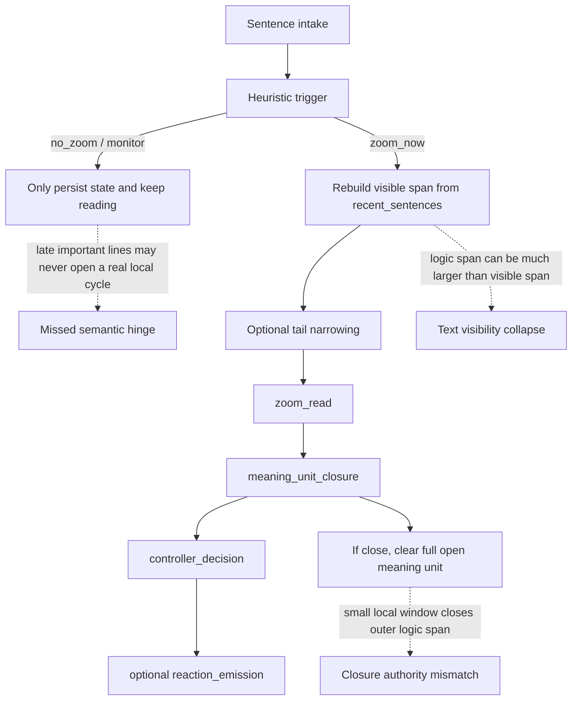
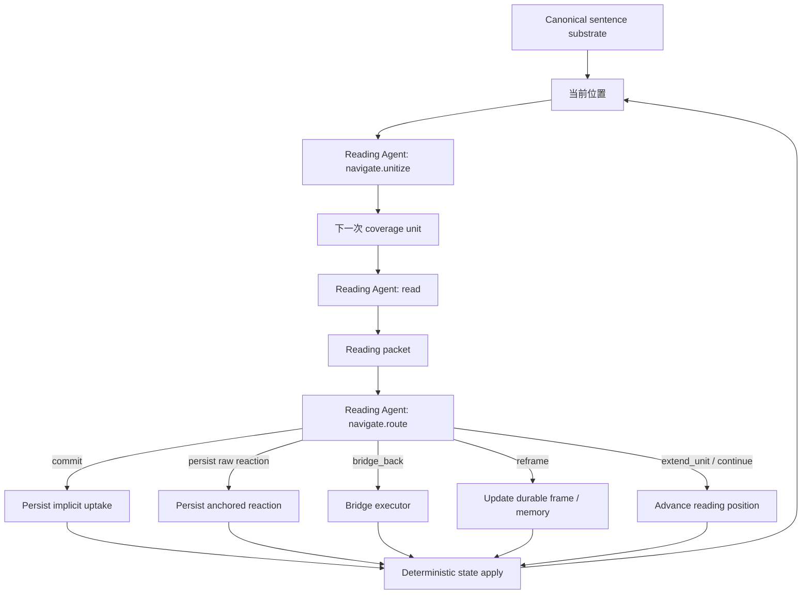

# Long-Span 正式 judged eval 后续反思与机制重设计决策备忘

状态：`ongoing`

对应正式 judged run：`attentional_v2_accumulation_benchmark_v1_judged_rerun_20260407`

相关文档：

- [主解释报告](./attentional_v2_accumulation_benchmark_v1_judged_rerun_20260407_interpretation.md)
- [打分关键反应附录](./attentional_v2_accumulation_benchmark_v1_judged_rerun_20260407_score_impact_reaction_appendix.md)

## 1. 文档定位

这份文档不是重新解释 judge 结果，也不是新的逐题证据附录。

它的用途是：

- 记录上一轮 bounded long-span eval 在机制层面的后续反思
- 把逐题讨论沉淀成设计判断和后续实现边界
- 给后面的机制改造提供方向约束

它不负责沉淀“评测报告应该怎么写”的通用规范；这里应只保留由本轮评测结果反推出的机制问题、机制优点和后续改造方向。

当前约束：

- 这份文档是同一轮 long-span eval 的后续反思与决策文档
- 它最终会汇总 `7` 道题的经验
- 目前只完整落下了 `probe 1` 的机制反思
- 后续其余 probes 的经验应继续追加到这份文档，而不是散落在聊天记录里

## 2. 当前填充状态

| Probe | 状态 | 当前用途 |
| --- | --- | --- |
| `5.1 《活出生命的意义》 probe 1` | `completed` | 第一批高置信机制结论与重设计方向来源 |
| `5.2` - `5.7` | `pending` | 待继续逐题审视，并判断是否修正或补强本文的设计结论 |

## 3. 当前已确认的核心结论

基于 `probe 1` 的运行时痕迹、报告核对、以及后续机制讨论，当前可以先确认三条高置信判断。

### 3.1 `attentional_v2` 当前的语义触发器不能继续依赖写死规则

`attentional_v2` 当前决定 `no_zoom / monitor / zoom_now` 的 trigger 不是 LLM，而是程序写死的 cheap rule gate。

典型规则包括：

- 句首转折词
- 英文定义/区分短语
- 英文强断言词
- 与上一句词汇重合骤降
- 问号或 `why/how`
- 是否命中已有 motif / unresolved reference key
- `open meaning unit` 是否达到 cadence guardrail

对应实现可见：

- `reading-companion-backend/src/attentional_v2/intake.py`
- 尤其是 `detect_trigger_signals()` 与 `_trigger_output()`

这条设计在 `probe 1` 上暴露出高风险：

- 重要句子完全可能不长得像这些规则所偏好的表面语言现象
- 中文长段中的“回答型句子”“枚举型框架句”“晚段收束句”尤其容易漏掉
- 一旦 trigger 没开，文本就不会进入真正的 LLM local cycle
- 这意味着错误不是“理解差一点”，而是“根本没被送进大模型”

结论：

- 语义上是否值得停下来阅读，不能再交给写死 trigger 规则
- deterministic code 可以保留在 substrate、预算、持久化、安全约束层
- 但 semantic gating 必须交给语义控制器，而不能继续靠字符级代理规则

### 3.2 当前 span 体系过多，而且 authority 没有对齐

`probe 1` 的讨论明确暴露出：当前机制里不是只有一个“正在读的文本区间”，而是至少同时存在下面几层。

| 区间 | 当前作用 | 当前控制位置 |
| --- | --- | --- |
| canonical sentence | 共享句子 substrate | `src/reading_core/sentences.py` |
| `recent_sentences` | 滚动最近窗口 | `state_ops.push_local_buffer_sentence()` |
| `open_meaning_unit_sentence_ids` | 逻辑上尚未闭合的长 span | `local_buffer` |
| `current_span_sentences` | 从 recent window 重建出的当前可见 span | `runner._span_sentences()` |
| `analysis_span_sentences` | 真正送进 local cycle 的分析 span | `select_local_cycle_span()` |
| `anchor_backcheck_window` | closure 用的小回看窗口 | `_anchor_backcheck_window()` |

这些区间只有在非常简单的情况才会重合。

当前机制最危险的问题不是“span 多”本身，而是：

- 逻辑 span 可以很长
- 真正送进 local cycle 的却只剩 recent tail
- 尾部分析窗还可以继续裁短
- 但最终 `close` 作用回去时，关闭的是整个 logic span

也就是说，当前机制里存在明显的 authority mismatch：

- 一个内部小窗的语义判断
- 在控制一个外部大 span 的生命周期

这不是局部 prompt wording 问题，而是结构问题。

### 3.3 `reaction_emission` 是问题，但不是首因

`probe 1` 讨论后可以明确：

- `reaction_emission` 确实会把一些已经形成的局部理解再过滤掉
- 这会让最终可见证据变薄，评测报告也更难读

但在当前失败链条中，它不是第一断点。

更靠前的主问题是：

1. 关键句没有被 semantic gate 升格成新的 local read event
2. open span 拖太长
3. 晚段 hinge 没有获得与其重要性相称的语义处理权

`reaction_emission` 更像是：

- 在本来就偏少的局部理解之上
- 又多加了一层 conservative filtering

所以后续改造顺序应是：

1. 先修 semantic gating
2. 再修 span authority
3. 再决定 reaction 外显层保留到什么程度

## 4. Probe 1 给出的失败链条

`5.1 《活出生命的意义》 probe 1` 当前最重要的贡献，不是“又多了一题 V1 胜”，而是它暴露了 `attentional_v2` 一条很完整的失败链条。

在 `probe 1` 上，问题表现为：

- `attentional_v2` 读到了后段关键句
- 但没有把它们升级成新的 `zoom_now`
- 后段关键句被吞进一个过长的 open span
- 真正 local cycle 只发生在更早的别处
- 最终没有形成与关键句相称的可见 reaction 与 bridge

因此，这题不应该被概括成“V2 反应不如 V1 好”，而应该先概括成：

- `V2` 没有把关键 late hinge 识别为必须进入语义深读的阅读事件

## 5. 对 simplicity and universality 的审视

当前 `V2` 在这两个目标上都不够理想。

### 5.1 为什么说不够 simple

当前 runtime 同时有：

- heuristic trigger
- open span 管理
- span 重建
- tail narrowing
- `zoom_read`
- `meaning_unit_closure`
- `controller_decision`
- `reaction_emission`
- lazy bridge retrieval

这导致两个问题：

- 机制解释成本很高
- 权责边界不清楚，尤其是谁在决定“该不该读”“读到哪算收口”“谁有权关闭 span”

### 5.2 为什么说不够 universal

当前 trigger 依赖的不是 general semantic judgment，而是局部词面规则。

这天然会带来：

- 语言偏置
- 文体偏置
- 显著词面现象偏置
- 对“语义重要但表面不吵”的句子缺少覆盖保证

从第一性原理上看，一个 long-span 机制如果要对真实文本保持 universality，就不能把“是否值得进入深读”建立在有限枚举的表面模式上。

## 6. 当前建议的重设计方向

这部分是当前基于 `probe 1` 给出的设计方向，不代表已经完成所有 probes 审核后的最终实现蓝图，但它已经足够作为后续机制讨论的工作基线。

### 6.1 总方向：从多重半语义控制，收束到同一个 Reading Agent 的两个动作：`navigate` + `read`

当前建议不再把未来设计表述成两个并列“角色”或两个分离“agent”，而是收束成：

- 一个 Reading Agent
- 两个核心动作：
  - `navigate`
  - `read`

这样命名更贴近我们真正想做的事。

我们要描述的不是两个人在协作，而是同一个阅读主体在做两种不同性质的动作：

- `navigate`
  - 决定接下来怎么前进
  - 决定下一次 coverage read 的边界在哪里
  - 决定读完之后是继续、收口、回桥、重构，还是外显反应
- `read`
  - 对当前 coverage unit 做一次真正的正式阅读
  - 产出这次阅读的理解结果包

因此，当前建议是：

- 不再保留“外层 heuristic trigger + 内层再判断”的双层语义治理
- 不再把阅读和控制写成两个分裂的长期主体
- 把当前分散在 `trigger / zoom_read / closure / controller / reaction gate` 的语义职责，重新收束成同一个 Reading Agent 的两个动作

其中：

- `navigate` 负责“怎么走”
- `read` 负责“把当前这段读明白”

这里要额外固定一条后来讨论中已经明确的原则：

- `navigate` 不是 permission gate
- 它不能决定一段正文“不被读”
- 它只能决定“下一次正式阅读先读到哪里”

也就是说：

- 所有正文都必须进入 mandatory `coverage read`
- `raw reaction` 不是阅读发生的前提
- 没有 `raw reaction`，不等于该段没被读到

`read` 负责输出：

- 当前 coverage unit 在说什么
- 当前局部 hinge 是什么
- 这次阅读留下的 `implicit uptake`
- 哪些句子是这次阅读真正抓到的 focal text
- 是否存在 unresolved pressure
- 是否出现 callback / bridge suspicion
- 原始 `raw_reaction`
  - 这是可选项，不是每次必有
- 边界证据
  - 比如为什么这段像是还没收完，或者为什么它看起来已经形成一个可收口的局部单元

`navigate` 负责决定：

- 下一次 coverage read 的边界在哪里
- 当前 span 是否只继续积累到该边界
- 读完之后是继续还是收口
- 是否桥接前文
- 是否需要 reframe
- 若存在 `raw_reaction`，如何如实持久化与展示
- 需要哪些状态更新

### 6.2 为什么这里用动作命名，而不用 `Reader / Controller / Thinker`

当前更合适的是动作命名，而不是角色命名。

原因有三点：

1. 产品语义上，我们希望它始终是“一个 agent 在阅读”，而不是两个 agent 轮流接管
2. `Controller` 太像独立组件名，容易让人误以为它是一个外置总控，而不是阅读主体自己的前进动作
3. `think` 太泛，像是一般性推理；这里我们要表达的是对当前文本的聚焦阅读，所以 `read` 更贴切

这里的 `read` 不是“整个系统都在广义上阅读文本”的空泛说法，而是一次明确的语义动作：

- 它有输入文本边界
- 它有阅读焦点
- 它有读后的结果包

这里的 `navigate` 也不是单纯的流程调度名词，而是阅读主体的前进动作：

- 是继续往前走
- 还是先把下一次 coverage unit 划出来
- 是不是要回桥
- 这个 span 现在能不能收
- 哪个 reaction 值得外显

### 6.3 `navigate` 的两个子职责：`unitize` 与 `route`

虽然顶层仍然只保留 `navigate` 和 `read` 两个动作，但为了避免 `navigate` 被说得过泛，当前建议把它内部再分成两个子职责：

- `navigate.unitize`
  - 在当前位置之后，用 bounded forward text 决定下一次 coverage read 的边界
- `navigate.route`
  - 在 `read` 返回之后，决定下一步怎么走

这样拆分的原因是：

- 我们既不希望 `navigate` 退回成死规则 trigger
- 也不希望 `read` 反过来偷偷承担“决定自己要读到哪”的边界裁决

`navigate.unitize` 的职责是：

- 尊重作者结构给出的硬边界和强边界
- 在结构内部决定下一个 coverage unit 到哪结束
- 输出一个可审计的边界决定，而不是正文解释本身

`navigate.route` 的职责是：

- 消费 `read` 的阅读结果包
- 决定：
  - `commit_silent`
  - `persist_raw_reaction`
  - `extend_unit`
  - `bridge_back`
  - `reframe`

### 6.4 旧节点如何并入新动作

为了避免新文档只是换名字不换结构，下面明确旧节点与新动作的关系。

| 当前 V2 节点 | 新设计中的归属 |
| --- | --- |
| heuristic `trigger` | 不再决定“文本值不值得被读”；被 `navigate.unitize` 的前瞻语义定界取代 |
| `zoom_read` | 吸收进 `read`，不再保留为一个单独拥有结构权力的节点 |
| `meaning_unit_closure` | `read` 提供边界证据，`navigate.route` 决定是否真正收口 |
| `controller_decision` | 吸收进 `navigate.route` |
| `reaction_emission` | 若保留，只应退化为轻量 persistence / formatter 层；原始 reaction 的语义来源与存在性回到 `read` |
| bridge retrieval / resolution | 可以保留为执行器或子流程，但是否需要桥接应由 `navigate.route` 决定 |

这样改完之后，语义层就不再是散落的多个半控制节点，而是清楚地变成：

- `navigate.unitize` 决定“下一次先读到哪里”
- `read` 提供“当前这段究竟读出了什么”
- `navigate.route` 决定“读完之后下一步该怎么走”

### 6.5 总方向：边界必须以作者结构为骨架，再由语义定界细化

关于 coverage unit 的边界，当前不再建议使用“段落结束或固定句数上限直接定界”这种过于简化的表述。

更合理的原则是：

- 作者原文给出的结构是第一层骨架
- 语义定界是在这层骨架之上做细化，而不是把作者结构抹平

当前建议的边界层次如下：

1. 硬边界
   - chapter
   - section / 小节
   - sentence
2. 强边界
   - paragraph
   - 说话人切换
   - 列表项切换
   - 明显场景切换
3. 语义收口信号
   - 一个定义是否已经讲完
   - 一个局部对比是否已经成立
   - 一个问题-回答局部是否已经闭合
   - 一个叙事或论证动作是否已经相对完成
4. 继续展开信号
   - 指代未落地
   - 枚举未完
   - 转折/让步只开了头
   - 句群还在完成同一个动作

这里要强调：

- 第 `2` 到第 `4` 层都不适合再由死规则判断
- 它们应由 `navigate.unitize` 在 bounded forward text 上做语义裁决

因此，`navigate.unitize` 更准确的角色不是“边界创造者”，而是：

- 以作者结构为主骨架的边界裁决者

### 6.6 总方向：`navigate.unitize` 的 preview window 要有硬上限，但不应默认大到整章

关于 `navigate.unitize` 往前看的 preview window，当前建议如下：

- 不跨 chapter
- 默认不跨 section / 小节
- paragraph 是默认语义外壳

当前更推荐的默认前瞻范围不是“整章”或“当前位置之后尽量多看”，而是：

- 当前段落剩余部分
- 加上同一 section 内的下一段

只有在下面这些情况，才建议再额外向后扩一段：

- 当前段特别短
- 当前段明显未完
- 当前段对下一段有强 continuation pressure

这样做的原因不是 token 不够，而是：

- unitization 仍然要保持 live reading 的节奏感
- 不应让 coverage unit 过度依赖很后面的文本来倒推边界
- `navigate.unitize` 应该是 bounded forward semantic judgment，而不是整章级 hindsight planning

因此，当前推荐姿态是：

- chapter / section 是 preview 的硬上限
- paragraph 是 preview 的默认组织外壳
- 默认前瞻是“当前段落 + 下一段”
- 特殊情况下再有限放宽，而不是默认整章扫描

### 6.7 总方向：coverage unit 本身也要有长度上限，避免重新吞掉局部 hinge

即使 `navigate.unitize` 的 preview window 可以比最终 coverage unit 更长，coverage unit 本身仍然需要上限。

这不是因为模型上下文不够，而是因为：

- `read` 读的应该是一个局部可理解的阅读单元
- coverage unit 太大，会冲淡 `implicit uptake`
- coverage unit 太大，会让 `raw reaction` 更难锚定到具体文本
- coverage unit 太大，会把我们重新带回“大 span 吞小 hinge”的老问题

当前建议的 coverage unit 约束如下：

1. 结构硬上限
   - 不跨 chapter
   - 默认不跨 section / 小节
2. 默认目标形态
   - `1` 个段落
3. 允许的有限放宽
   - `2` 个很短、且明显属于同一个局部动作的相邻段落
4. 长度兜底
   - soft cap：大约 `6-8` 句
   - hard cap：大约 `10-12` 句
5. 单个超长段落的处理
   - 允许段内切
   - 但只能在句边界上切
   - 并优先选择相对自然的语义收口点

如果一次 coverage unit 是被 cap 截断的，那么它不应假装自己已经自然闭合，而应显式留下：

- `implicit uptake`
- continuation pressure

这样下一次 coverage unit 才能自然接着读，而不是让前一段阅读结果把未完动作误判成已收口。

### 6.8 总方向：边界决定必须达到最小可审计力度

这里说的“可审计”，不是要求保留隐藏推理过程，也不是要求系统吐出长篇 chain-of-thought。

这里的意思是：

- 如果以后回头看，我们必须能回答“为什么这次在这里停”

因此，当前建议 `navigate.unitize` 的最小审计信息至少包括：

- `start_sentence_id`
- 它实际看了哪一段 `preview range`
- 它选定的 `end_sentence_id`
- `boundary_type`
  - 例如：
    - `paragraph_end`
    - `intra_paragraph_semantic_close`
    - `cross_paragraph_continuation`
    - `section_end`
    - `budget_cap`
- `evidence_sentence_ids`
- 一句短理由
- 是否仍存在 continuation pressure

这层审计信息的意义是：

- 以后如果切错了，我们知道错在 preview window、结构判断、语义收口判断，还是 cap 截断

### 6.9 总方向：`implicit uptake` 应由 `read` 统一负责，Context / State Management 在 V2 的 typed spine 上重组

当前讨论里已经明确：

- `implicit uptake` 应该由 `read` 负责
- 不应由 `navigate` 代替正文阅读去偷偷写 memory

这意味着未来设计里：

- `read` 每次都必须产出 `implicit uptake`
- `raw reaction` 只是可选产物

但这还不够。为了真正解决 long-span 中“前文记不住、记住了也不容易调出来”的问题，Context / State Management 不能只停留在“把现有 memory territory 继续保留”。

当前更合适的方向是：

- 保留 `V2` 的 typed-state 骨架
- 吸收 `V1` 已经证明有用的可复用记忆组织方式
- 把状态主架构收敛成少数几个语义清楚、职责稳定的层，而不是继续让多个并列 store 竞争“谁才是主记忆”

这里要先记一条高置信观察：

- `V1` 当前的优势，不是它的状态类型更先进
- 而是它会把前文整理成后续 prompt 真能直接继续使用的记忆包

`V1` 当前已经证明有用的部分包括：

- `book_arc_summary`
- `chapter_memory_summaries`
- `open_threads`
- `salience_ledger`
- `recent_segment_flow`
- query-aware 的 `memory packet assembly`

`V2` 当前更强的则是：

- hot / retrieval / reflective 的分层意识
- typed object 和 source-linked relation
- 对 motif、unresolved reference、callback、bridge 的显式建模

因此，当前不建议：

- 原样把 `V1` 的 memory blob 搬到 `V2`
- 也不建议继续让 `V2` 保持现在这种“store 很多，但没有一个足够清楚的主记忆界面”的状态

更合理的方向是：

- 用 `V2` 的 typed spine 做底层状态
- 用吸收了 `V1` 长处的派生 memory packet 做 prompt 输入层

### 6.9.1 建议的主状态结构：四层状态 + 一个证据底座

当前建议把未来的 Context / State Management 收敛成下面这个结构：

1. `working_state`
   - 当前热状态
   - 只放下一步动作真正需要的活信息
   - 例如：
     - 当前 focus
     - active hypotheses
     - open questions
     - active tensions
     - bridge pull
     - local unresolved items

2. `concept_registry`
   - 重要对象的工作词典
   - 统一承载：
     - 人物
     - 地点
     - 机构
     - 术语
     - 抽象概念
     - 关键物件
   - 它回答的是：
     - “这个东西是谁/是什么”
     - “在这本书里为什么重要”
     - “它和哪些 thread 有关”

3. `thread_trace`
   - 故事线 / 论证线 / 关系线 / 问题线的统一轨迹层
   - 不再人为分成“叙事类 memory”和“论证类 memory”两套系统
   - 它回答的是：
     - “这条线现在发展到哪了”
     - “之前提出了什么”
     - “后面是延伸、转折、回答、反证，还是收束”

4. `reflective_frames`
   - 较慢、较稳定的章级 / 书级理解
   - 对应当前 `V2` 里已经存在的：
     - `chapter_understandings`
     - `book_level_frames`
     - `durable_definitions`
   - 但语义上统一视为“慢状态”，而不是多个并列主入口

5. `anchor_bank`
   - source-grounded 的证据底座
   - 保存：
     - retained source anchors
     - typed relations
     - callback / motif / trace 相关索引
   - 它回答的是：
     - “之前哪句话、哪段话值得保留”
     - “如果要回桥，应该回到哪几个原文锚点”

这里特别要强调：

- `concept_registry` 是“词条层”
- `thread_trace` 是“脉络层”
- `reflective_frames` 是“慢总结层”
- `anchor_bank` 是“证据底座”

它们彼此链接，但不应互相复制。

### 6.9.2 两个直接来自阅读体验的设计约束

这次讨论里形成了两个非常值得保留的直觉，而且它们和真实阅读过程高度一致：

1. 重要概念会被慢慢记住
   - 阅读不是只记“漂亮句子”
   - 人物、地名、机构、术语、抽象概念、关键物件，都会逐步形成稳定的对象记忆
   - 这正是 `concept_registry` 的职责

2. 故事线或论证线会被慢慢记住
   - 阅读时，我们会逐步形成一种“这条线是怎么发展过来的”的脉络感
   - 不需要极细，但需要可回溯、可检索
   - 这正是 `thread_trace` 的职责

因此，当前建议的 memory 结构不是单纯从现有代码拼出来的，而是：

- 同时尊重人类阅读体验
- 同时吸收 `V1` 的实用性
- 同时保留 `V2` 的 typed-state 长处

### 6.9.3 现有 V2 状态的处置原则

当前不建议“全部推倒重来”，而建议按下面的原则重组：

- 保留，并改名或收紧职责：
  - `working_pressure` -> `working_state`
  - `anchor_memory` -> `anchor_bank`
  - `reflective_summaries` -> `reflective_frames`

- 保留，但降为辅助职责而不是主记忆层：
  - retrieval helper / index-like 结构
  - 它们仍然可以存在，但不应该再和主状态层并列争夺语义地位

- 合并或吸收：
  - `motif_index`
    - 更适合并入 `concept_registry` 与 `anchor_bank` 的连接结构
  - `trace_links`
    - 更适合并入 `thread_trace`
  - `unresolved_reference_index`
    - 热的部分放进 `working_state`
    - 需要跨段持续的部分放进 `thread_trace`

- 不应原样保留为未来核心语义入口的：
  - `trigger_state`
  - `gate_state`
  - `local_buffer`
  - 一切强绑定在 `no_zoom / monitor / zoom_now` 和旧 `closure / controller` 栈上的语义写入逻辑

### 6.9.4 `knowledge_activations` 的角色应明显收窄

这次讨论后，当前不再建议把 `knowledge_activations` 继续当成主记忆层。

更合适的理解是：

- 它原本的职责，是记录“当前文本是否触发了某种外部知识、典故、思想背景、文学回声或结构回声”
- 它关心的是：
  - `recognition_confidence`
  - `reading_warrant`
- 它并不是为了记“书里前面出现过什么人物、概念、事件”

因此，当前建议是：

- 默认让外部知识激活留在 `read` 的即时认知事件里
- 不再默认把它维护成一个重的 durable memory store
- 只有当某个 activation 真的变成后续 thread 理解所必需的背景，或者已经影响 durable frame 时，才把其结果沉淀到：
  - `concept_registry`
  - `thread_trace`
  - 或 `reflective_frames`

也就是说：

- 外部知识可以在 `read` 里直接想起、直接使用
- 不必因为“想起了一次”就强制写成长期状态

### 6.9.5 `anchor_bank` 不应承担泛化记忆职责

这里还需要明确一条边界：

- `anchor_bank` 不是“什么都往里塞的大记忆桶”

它不应该负责直接存下面这些语义对象本身：

- 人物是谁
- 某个概念是什么意思
- 某条故事线整体发展到了哪里
- 某条论证线目前的阶段判断

这些应分别落在：

- `concept_registry`
- `thread_trace`
- `reflective_frames`

`anchor_bank` 真正负责的是：

- 保留 source-linked evidence
- 支持 callback / bridge / revisit
- 作为其他状态层的证据底座

因此更准确的关系是：

- `concept_registry` 是词条
- `thread_trace` 是脉络
- `reflective_frames` 是稳定理解
- `anchor_bank` 是这些层背后的原文证据

### 6.9.6 Prompt 输入层应是派生视图，而不是底层状态原样直出

这里还需要保留 `V1` 一个非常重要的经验：

- 状态本身如何存是一回事
- prompt 最终拿到的输入长什么样，是另一回事

当前建议是：

- 底层状态保持 `V2` 风格的 typed spine
- 但每次 `navigate.unitize / read / navigate.route` 真正收到的 memory packet，应是从这些状态派生出来的 query-aware 视图

也就是说：

- `V1` 的 `book_arc_summary / open_threads / salience_ledger / recent_segment_flow / chapter summaries` 这种“易用记忆包”经验应保留
- 但它应是派生层，而不是把底层 durable state 重新做成一个大 blob

因此，真正要改的重点不是“memory 文件全部重做”，而是：

- 由 `read` 重新成为 `implicit uptake` 的统一生产者
- 让底层状态结构更清楚
- 让 prompt 输入层重新拥有 `V1` 那种已被证明有用的可用性

### 6.9.7 压缩不是主目标；先解决状态维护，再决定何时需要 compaction

当前讨论里已经进一步明确：

- “压缩”本身不是目的
- 真正目的，是让阅读状态长期保持可用、可检索、可恢复，而不是无限膨胀

因此，当前不建议一上来就把未来机制设计成“必须有一个中心 compactor”的系统。

更合理的次序应当是：

1. 先把状态分层和职责边界定清楚
2. 先让 `read` 成为 `implicit uptake` 的统一生产者
3. 先让 prompt 输入转成 index-first 的派生视图
4. 再判断是否真的需要显式 compaction

当前更接近真实需要的判断是：

- 现在已经有一些“压缩前置件”
  - `working_pressure` cooling
  - `reflective_promotion`
  - chapter-end `chapter_consolidation`
  - checkpoint / resume
- 但这些还不是一个完整的“压缩 + 重注入”系统

未来真正需要显式 compaction 的时机，应该至少满足下面之一：

- active packet 已经无法在预算内保持清晰，除非开始丢失仍然活着的语义材料
- 发生 pause / resume，需要生成一个可恢复的 session continuity capsule
- 发生 chapter boundary，需要把本章的活状态压缩成下一章可继续携带的有界表示

如果未来引入 compaction，当前建议它遵守三条边界：

- 它优先发生在边界时刻，而不是每一步都偷偷运行
  - 例如：
    - chapter end
    - pause / resume
    - 明确的 hard budget breach
- 它产出的不是“替代一切的大摘要”，而是可回水化的 continuation capsule
- 它不能把 durable state 和 source evidence 一起压扁
  - `concept_registry / thread_trace / reflective_frames / anchor_bank` 仍应作为独立层存在

### 6.9.8 `always reload`、`on-demand retrieval` 与 side context 的当前边界

围绕上下文载入策略，当前已经可以先定出一版高置信边界。

`always reload` 当前更适合只保留：

- 当前 `session continuity capsule`
- 当前 `working_state`
- 当前 chapter 的短 `reflective frame`
- 极短的 active `concept / thread digest`

`on-demand retrieval` 当前更适合承载：

- 详细 `concept_registry` 词条
- 详细 `thread_trace` milestones
- `anchor_bank` 中的原文锚点与 anchor bundles
- 历史 raw reactions / evidence bundles
- 大段原文 excerpt

也就是说，真正应该始终背在 prompt 里的，只能是“继续读下去立刻需要的极少量状态”；详细历史应当默认留在可检索层，而不是常驻层。

同时，当前也进一步明确：

- 不应为了“可能有帮助”就引入多 `sub-agent`
- Reading Agent 的主体性和连续性必须优先

因此，当前不建议：

- 把主阅读循环改造成多 agent orchestration
- 让外部搜索、回看、核对默认都变成 sub-agent 任务

如果后面真的引入 side context，它更适合承担的是：

- 高体积回看
- 搜证
- 低频外部核查
- bridge verification

而不是接管主阅读循环本身。

### 6.10 总方向：当前基线仍可使用同一模型，但 `unitize / read / route` 应分成不同 prompt family

关于 `navigate` 和 `read` 的模型组织，当前建议是：

- 暂不要求它们使用不同模型
- 先继续使用与当前机制一致的同一模型目标
- 但整体仍应保持可配置

同时，虽然模型可以相同，prompt family 不应混成一套。

当前至少应拆成三类提示词职责：

- `navigate.unitize`
  - 只负责边界裁决
- `read`
  - 负责 `implicit uptake`、`continuity / reuse result` 与可选 `raw reaction`
- `navigate.route`
  - 负责 `commit / extend / bridge / reframe / surface`

也就是说：

- 可以是同一个模型
- 但不应是同一个提示词任务

### 6.11 总方向：减少 span 种类，并对齐 span visibility 与 span authority

后续机制应该遵守一条硬约束：

- 一个节点只能关闭它真实看过的文本

这意味着未来设计里：

- 不应再允许一个只看见 tail 小窗的 closure，直接关闭整个长 logic span
- 若 older text 不再全文可见，就必须有显式 carry-forward representation
- 若连 carry-forward representation 都没有，就不能宣称“整段已经被读懂并收口”

### 6.12 总方向：deterministic code 只保留在 substrate 和 guardrail 层

deterministic code 仍然有价值，但价值应限定在：

- sentence substrate
- locator 与持久化
- 预算控制
- observability
- resume / recovery
- 安全 guardrail

它不应继续承担：

- semantic trigger
- semantic closure
- semantic bridge worthiness judgment

同时也要明确：

- `navigate.route` 可以决定状态应该怎么变
- 但真实的 state write 仍应由 deterministic executor 落盘
- 不应把“真正的阅读、控制决策、状态真实维护”塞进同一次全权 LLM 调用
- `read` 应保持为一次相对纯的阅读动作，而不是顺手接管状态机
- `navigate.unitize` 可以看当前位置之后的一段 bounded forward text 来做边界裁决
  - 但它不应把那段未来文本的正文解释直接写入 durable memory
  - 真正的语义摄取仍然应发生在随后正式执行的 `read` 中

### 6.13 面向后续 `decision-log` 的改动-原因映射

为了避免后面真正实现时只记“改了什么”，却忘记“为什么必须这么改”，当前先把这一轮 long-span judged eval 到目前为止给出的高置信改动理由，压成一张可直接迁移到 `docs/history/decision-log.md` 的映射表。

这里要明确：

- 有些项是 judged 现象直接推出的结构性问题
- 有些项则是 judged 现象触发后，经后续机制讨论才收束出来的设计约束

两者都应该保留，但后面真正写 `decision-log` 时，不应把“eval 直接暴露的问题”和“在该问题上进一步做出的设计选择”混写成同一层证据。

| 计划改动 | 直接原因 | 本轮评测暴露出的现象 |
| --- | --- | --- |
| 废弃 heuristic semantic trigger 作为“值不值得读”的主入口 | 重要文本会因为词面规则不显眼而根本进不了 LLM | `5.1 probe 1` 中关键 late hinge 没有被升格成真正 local read event，导致“不是理解差一点，而是根本没被送进大模型” |
| 把顶层结构改成同一个 Reading Agent 的 `navigate + read` | 当前语义控制分散在 trigger / zoom / closure / controller / reaction gate，权责太碎，解释和调试都很困难 | 当前失败链条显示，真正的“阅读”“收口”“是否继续”“是否桥接”被多个半控制节点分割，难以保证一致性 |
| 所有正文都必须经过 mandatory coverage read | 不能再允许“没触发就没读” | long-span 失败不是单纯 reaction 少，而是有些文本根本没有获得正式阅读权 |
| 用作者结构为骨架 + bounded forward semantic unitization 来决定 coverage unit 边界 | 固定句数或过大的 open span 都会吞掉局部 hinge | 当前 span 体系中，大 logic span 被 late tail 小窗代表并最终被关闭，形成 authority mismatch |
| coverage unit 本身加上长度 cap，并在被截断时显式保留 continuation pressure | 否则会重新回到“大 span 吞小 hinge”，并把未完动作误判成已闭合 | `probe 1` 讨论里已经看到长 open span 会冲淡关键句，使重要 late 文本没有相称处理权 |
| `navigate.unitize` 的边界决定必须可审计 | 以后如果切错，需要知道错在 preview、结构判断、语义收口还是预算截断 | 当前机制里 span 太多、收口权太散，如果没有审计层，后面很难定位 unitization 错误 |
| `read` 必须同时产出 `implicit uptake` 与 `continuity / reuse result` | V2 现在即使“记住了一点”，也不稳定地把前文真正用到当前理解里 | 多题讨论都指向：V2 不如 V1 稳定地把 earlier material reuse 成明确 bridge / retrospect / carry-forward |
| continuity 默认依赖 `carry-forward context`，只在不够时才升级为 `active recall / look-back` | 利用前文不等于每次都去检索；真正的 retrieval 应该是例外而不是常态 | 我们讨论中已明确：更像人类阅读的是“带着已有脉络继续读”，而不是每段都翻回去找证据 |
| Context / State Management 收敛为 `working_state / concept_registry / thread_trace / reflective_frames / anchor_bank` | V2 现有 state 设计有 typed 优势，但实际可用性不如 V1；V1 则证明了“可直接继续使用的记忆包”确实重要 | long-span 结果显示：V2 在长距 continuity 和记忆再利用上弱于 V1；同时现有 store 过多、主记忆界面不清楚 |
| prompt 输入层改成 query-aware 派生视图，而不是把底层 state 原样塞给模型 | “怎么存”与“怎么给模型用”是两回事；V1 的强项恰恰在后者 | V1 的优势并不只在 memory territory，而在于它把前文整理成后续 prompt 真能继续使用的 packet |
| `knowledge_activations` 收窄为 `read` 内的即时外部知识激活 | 外部典故/背景不应和书内人物、概念、脉络记忆混为同一层 | 讨论中已明确：它更适合作为即时认知事件，而不是主 durable memory |
| `anchor_bank` 明确只做 source-grounded evidence base | 否则会重新变成“什么都往里塞的大记忆桶” | 我们已经区分清楚：人物/概念属于 `concept_registry`，故事线/论证线属于 `thread_trace`，`anchor_bank` 应只承载原文证据与链接 |
| 原始 `raw reaction` 的语义来源回到 `read`，如果真实产生就如实持久化与展示 | 我们要暴露 agent 的真实阅读反应，而不是为了展示去再加工或审美式筛掉它 | 当前 `reaction_emission` 会把已形成的局部理解再过滤一层，使评测证据变薄；而产品目标也不是二次改写反应 |
| 不把显式 compaction 当作先行实现目标，只在 chapter boundary / pause-resume / hard budget breach 考虑 continuation capsule | 现在更缺的是状态边界和可用性，而不是一个中心 compactor | 当前仓库里已有 cooling / promotion / consolidation / resume 等前置件，但还没有必要立刻引入完整 compaction 系统 |
| 当前不引入多 `sub-agent` 作为主阅读骨架 | Reading Agent 的主体性和连续性更重要，多 agent 编排会过早把系统变成 orchestration problem | 讨论中已明确：side context 若以后引入，只应用于高体积回看、搜证、核对，而不是接管主阅读循环 |

这张映射表的用途不是替代后续真正的 `decision-log`，而是提前固定：

- 以后实现时，每一项结构性改动都应能回指到哪类 eval 现象
- 以后写 `decision-log` 时，不应只写“采用了 navigate + read”，还应写清：
  - 为什么必须废弃旧 semantic gate
  - 为什么必须重组上下文管理
  - 为什么 raw reaction 的语义来源要回到 `read`
  - 为什么当前不把 compaction 和多 sub-agent 当作第一优先级

## 7. 当前建议的目标结构

下面是当前更符合 `simplicity and universality` 的目标形态。

这个结构里的关键变化是：

1. 不再用 heuristic trigger 决定哪些文本能进 LLM
2. 顶层语义结构不再写成两个主体，而是一个 Reading Agent 的两个动作
3. `navigate` 先做 `unitize`，在作者结构骨架内决定下一次 coverage read 到哪里结束
4. 所有正文都必须经过一次 mandatory `read`
5. `read` 每次都必须产出 `implicit uptake`，`raw reaction` 只是可选产物
6. `read` 只负责把当前单元读明白，不直接接管状态机
7. `navigate.unitize` 的 preview window 有硬上限，coverage unit 本身也有长度上限
8. span 的积累、可见性、收口权必须对齐
9. 原始 reaction 的语义来源回到阅读层，并且如果真实产生，就应如实保留和展示
10. 真实状态维护重新收回到 deterministic executor

这个顶层循环下，Context / State Management 也要同步收敛成：

- `working_state`
- `concept_registry`
- `thread_trace`
- `reflective_frames`
- `anchor_bank`

其中：

- `concept_registry` 与 `thread_trace` 是新的主语义层
- `reflective_frames` 保留较慢的章级 / 书级理解
- `anchor_bank` 作为所有 durable 语义层的 source-grounded evidence base
- prompt 输入使用这些状态派生出来的 query-aware memory packet，而不是把底层 store 原样塞给模型

## 8. 目标结构下的最小运行单元

后续机制可以收敛到下面这个更简单的单位循环。

1. 当前位置位于 canonical sentence stream 上
2. `navigate.unitize` 读取当前位置之后的 bounded forward text
   - 输入中保留作者结构信息：
     - chapter / section / paragraph / sentence
   - 默认前瞻是当前段落剩余部分加同一 section 内的下一段
   - 它的任务不是解释这些未来文本，而是确定“下一次 coverage read 到哪里结束”
3. `navigate.unitize` 输出 coverage unit 边界
   - 至少应是可审计的边界决定，而不是一句模糊的“这里差不多”
   - preview window 不跨 chapter，默认不跨 section
4. 调用 `read`
   - 输入是刚才确定的 coverage unit 正文
   - 同时带入：
     - `carry-forward context`
       - 这是默认随阅读带入的小量已有上下文
       - 它不是一次额外 retrieval 动作
     - 在确有必要时，才追加：
       - `active recall / look-back`
       - 这才是真正意义上的具体回看
   - coverage unit 默认以单段为目标，但仍受长度 cap 约束
5. `read` 返回 `reading packet`
   - `implicit uptake`
     - 这是每次必有的结果
      - 这里的 uptake 负责更新：
        - `working_state`
        - 必要时的 `concept_registry`
        - 必要时的 `thread_trace`
        - 以及后续可 promotion 的 `reflective_frames` 候选
   - `continuity / reuse result`
     - 这里回答的不是“状态怎么写”，而是：
       - 当前这段如何利用了前文
       - 它是在延续、澄清、回答、对照、反转，还是并行展开
       - 它关联了哪些 concept / thread / earlier anchor
   - 可选 `raw reaction`
     - 这是阅读时自然产生的原始反应
     - 不是二次加工后的展示文案
   - 可选 `bridge pull / revisit pull`
   - 边界证据
   - focal text
   - unresolved pressure
6. `navigate.route` 再消费这份 `reading packet`，决定：
   - `commit`
   - `persist raw reaction`
   - `extend_unit`
   - `bridge_back`
   - `reframe`
7. deterministic executor 只执行 `navigate.route` 已经做出的决定，而不是再二次抢夺解释权

这与当前 `V2` 的一个重要区别是：

- 阅读语义不再被 heuristic gate 阻断在 LLM 之外
- 所有正文都会获得一次 mandatory coverage read，而不是只有“热点句”才进 LLM
- 控制语义不再分散在 trigger、closure、controller、reaction gate 四处
- `navigate.unitize` 负责定界，不负责偷偷替代 `read`
- 状态真实维护不再混进阅读语义调用里
- `read` 不再承担“读完顺手接管整个状态机”的职责
- 没有 `raw reaction` 的段落，也会留下 `implicit uptake`
- `read` 不是只回答“这段讲了什么”，还必须回答“这段如何利用了前文”
- 默认 continuity 应由 `carry-forward context` 支撑，而不是把“回想前文”全部等同于一次额外 retrieval
- 只有当默认上下文不够时，才进入 `active recall / look-back`
- 未来 memory 的统一上游将转到 `read`，而不是散落在多个 trigger / gate / closure 旁支中
- `concept_registry` 和 `thread_trace` 将承担“读过之后留下什么”的主职责，而不是让 `anchor_memory` 或 `knowledge_activations` 混合承担
- 原始 reaction 如果真实产生，就应如实保留和展示，而不是再由独立语义节点把它改写成“更适合展示的版本”

## 9. 当前先行决策

下面这些结论在继续看其他 probes 之前，已经足够作为当前高置信工作约束。

### 9.1 已决定

- 不继续把 heuristic trigger 当成未来机制的长期正确方向
- 不继续接受“没进 LLM 就直接略过”的 semantic gating 方式
- 不继续接受“内部小窗关闭外部长 span”的 authority mismatch
- 不把 `reaction_emission` 当作下一轮最优先的修复点
- 顶层机制命名改用同一个 Reading Agent 的两个动作：`navigate` + `read`
- `navigate` 内部再分成 `unitize` 与 `route` 两个子职责
- `navigate` 负责定界和路由，但不负责替代正文的正式阅读
- `read` 负责一次正式阅读，不再用 `think` 这种更泛的词
- 所有正文都必须经过 mandatory coverage read
- `read` 每次都必须产出 `implicit uptake`
- `raw reaction` 只是 `read` 的可选产物，不是阅读发生的前提
- `read` 还必须产出 `continuity / reuse result`，明确当前阅读如何利用了前文
- coverage unit 的边界必须以作者结构为骨架，再由 bounded forward semantic unitization 细化
- `navigate.unitize` 的 preview window 不跨 chapter，默认不跨 section
- `navigate.unitize` 的默认前瞻基线是“当前段落剩余部分 + 下一段”
- coverage unit 默认以单段为目标，只在局部动作明显连续时有限放宽到两个短段
- coverage unit 本身必须受长度 cap 约束；若被 cap 截断，则必须显式保留 continuation pressure
- `navigate.unitize / read / navigate.route` 可以继续使用同一模型目标，但应拆成不同 prompt family
- 现有 memory territory 可部分复用，但 `implicit uptake` 的统一生产权要回到 `read`
- continuity 的默认实现应依赖 `carry-forward context`
- 只有当默认上下文不足以支撑当前阅读时，才触发 `active recall / look-back`
- Context / State Management 应收敛成：
  - `working_state`
  - `concept_registry`
  - `thread_trace`
  - `reflective_frames`
  - `anchor_bank`
- `concept_registry` 承担人物、地点、机构、术语、抽象概念等“对象级记忆”
- `thread_trace` 承担故事线 / 论证线 / 关系线 / 问题线等“脉络级记忆”
- `reflective_frames` 承担较慢的章级 / 书级稳定理解
- `anchor_bank` 只作为 source-grounded evidence base，不承担泛化记忆职责
- `knowledge_activations` 的角色应明显收窄：
  - 默认留在 `read` 的即时外部知识激活里
  - 不再默认作为重的 durable memory store
- 底层状态继续采用 V2 风格的 typed spine，但 prompt 输入层应重新吸收 V1 的 query-aware memory packet 长处
- 当前不把“显式上下文压缩器”当作先行实现目标
- 未来若需要 compaction，它应发生在 chapter boundary、pause / resume、或 hard budget breach 这类边界时刻
- compaction 的目标应是 continuation capsule 与可回水化入口，而不是把 durable state 统统替换成一段总摘要
- `always reload` 只保留：
  - `session continuity capsule`
  - 当前 `working_state`
  - 当前 chapter 的短 `reflective frame`
  - 极短的 active `concept / thread digest`
- `on-demand retrieval` 承载：
  - 详细 concept entries
  - 详细 thread milestones
  - `anchor_bank` 中的原文证据
  - 历史 reactions / evidence bundles
  - 大段原文 excerpt
- 如果 `raw reaction` 在 `read` 中真实产生，应如实持久化并展示
- 不再把“是否显示原始反应”设成独立的语义审美 gate
- 当前不引入多 `sub-agent` 作为主阅读骨架
- 若未来引入 side context，它只应用于高体积回看、搜证、外部核查、bridge verification 等辅助动作
- 后续改造优先讨论 `navigate + read` 的重设计，而不是在当前 trigger 上补更多规则

### 9.2 暂缓决定

- 不同文体下 preview window 的放宽策略要不要进一步分型
- coverage unit 的 soft cap / hard cap 最终定在哪个数值最稳
- `navigate.unitize` 输出的审计信息最终落成怎样的 artifact 形态
- `working_state / concept_registry / thread_trace / reflective_frames / anchor_bank` 的精确字段最小集
- `read` 每次更新这五层状态的操作粒度与节奏
- `knowledge_activations` 是否保留轻量 audit/debug 痕迹，以及若保留应如何约束
- `session continuity capsule` 的精确字段最小集
- compaction 的 soft budget / hard budget 触发阈值最终定在哪个量级
- `always reload` 中 active `concept / thread digest` 的目标尺寸与裁剪策略
- `continuity / reuse result` 的精确输出契约如何定义
- `carry-forward context` 默认应包含哪些最小字段
- 在什么条件下才允许升级为 `active recall / look-back`
- 是否需要在后续实现中把 `unitize / read / route` 分到不同模型目标
- current `zoom_read` / `closure` contract 在新设计里是吸收、重写，还是部分保留
- `reaction_emission` 是否完全移除，还是退化为轻量 persistence / formatter layer
- bridge executor 在新结构里是否仍保留单独节点
- 若以后真的引入 side context，其调用阈值、返回契约、以及与主阅读线程的边界如何定义

这些问题不适合只基于 `probe 1` 就完全定案，后面继续看其余 probes 时应一并判断。

## 10. 对后续实现的工作边界

当前文档的作用是：

- 固化方向
- 固化约束
- 固化“不应继续沿着哪条路修补”

它**不是**当前回合的代码改造指令。

在继续审视剩余 probes 之前，当前建议是：

- 先不要急着在现有 `V2` 上做零散补丁
- 先继续从 long-span 其余题目中收集是否还有新的结构级问题
- 等其余题目的经验补齐后，再一次性决定：
  - 哪些是框架级变动
  - 哪些是 prompt / node contract 级变动
  - 哪些只是 executor 层实现细节

## 11. 当前证据入口

当前这批结论主要来自以下证据面：

- 主解释报告中的 `5.1`
- 打分关键反应附录中的 `5.1`
- `probe 1` case payload
- `probe 1` 的 `attentional_v2` runtime bundle
- `attentional_v2` 机制文档与 runtime 代码

关键运行时入口：

- `reading-companion-backend/eval/runs/attentional_v2/attentional_v2_accumulation_benchmark_v1_judged_rerun_20260407/shards/main/outputs/huochu_shengming_de_yiyi_private_zh__13_16/attentional_v2/_mechanisms/attentional_v2/runtime/local_buffer.json`
- `reading-companion-backend/eval/runs/attentional_v2/attentional_v2_accumulation_benchmark_v1_judged_rerun_20260407/shards/main/outputs/huochu_shengming_de_yiyi_private_zh__13_16/attentional_v2/_mechanisms/attentional_v2/runtime/trigger_state.json`
- `reading-companion-backend/eval/runs/attentional_v2/attentional_v2_accumulation_benchmark_v1_judged_rerun_20260407/shards/main/outputs/huochu_shengming_de_yiyi_private_zh__13_16/attentional_v2/_mechanisms/attentional_v2/internal/prompt_manifests/zoom_read.json`
- `reading-companion-backend/eval/runs/attentional_v2/attentional_v2_accumulation_benchmark_v1_judged_rerun_20260407/shards/main/outputs/huochu_shengming_de_yiyi_private_zh__13_16/attentional_v2/_mechanisms/attentional_v2/internal/prompt_manifests/meaning_unit_closure.json`

## 12. 后续追加规则

后面继续看 `5.2` 到 `5.7` 时，新增内容应优先补到本文，而不是只停留在聊天记录中。

推荐补充顺序：

1. 逐题新增“该题揭示的结构级问题”
2. 判断它是否支持、削弱、或修正本文第 `3` 到第 `9` 节的结论
3. 如果其余题目给出不同方向的证据，再回过头修订本文的当前决策部分
