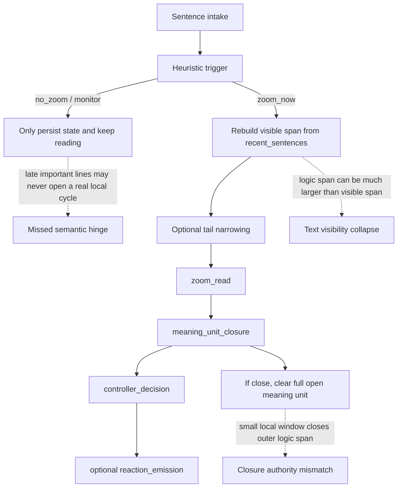
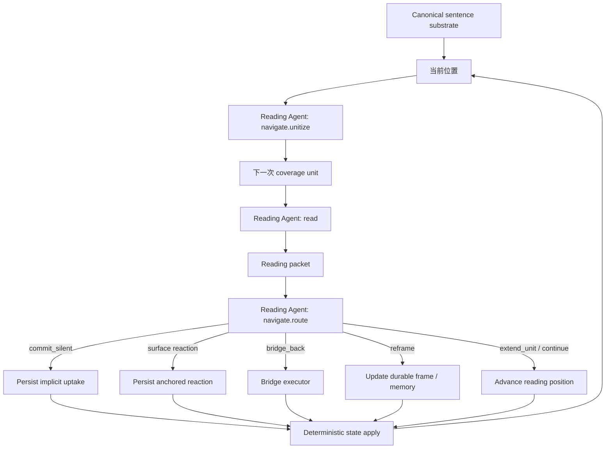

# Long-Span 正式 judged eval 后续反思与机制重设计决策备忘

状态：`ongoing`

对应正式 judged run：`attentional_v2_accumulation_benchmark_v1_judged_rerun_20260407`

相关文档：

- [主解释报告](./attentional_v2_accumulation_benchmark_v1_judged_rerun_20260407_interpretation.md)
- [打分关键反应附录](./attentional_v2_accumulation_benchmark_v1_judged_rerun_20260407_score_impact_reaction_appendix.md)

## 1. 文档定位

这份文档不是重新解释 judge 结果，也不是新的逐题证据附录。

它的用途是：

- 记录上一轮 bounded long-span eval 在机制层面的后续反思
- 把逐题讨论沉淀成设计判断和后续实现边界
- 给后面的机制改造提供方向约束

当前约束：

- 这份文档是同一轮 long-span eval 的后续反思与决策文档
- 它最终会汇总 `7` 道题的经验
- 目前只完整落下了 `probe 1` 的机制反思
- 后续其余 probes 的经验应继续追加到这份文档，而不是散落在聊天记录里

## 2. 当前填充状态

| Probe | 状态 | 当前用途 |
| --- | --- | --- |
| `5.1 《活出生命的意义》 probe 1` | `completed` | 第一批高置信机制结论与重设计方向来源 |
| `5.2` - `5.7` | `pending` | 待继续逐题审视，并判断是否修正或补强本文的设计结论 |

### 2.1 报告撰写反思与后续规范

这轮 long-span 报告核对暴露出的，不只是机制问题，也有一组重复出现的报告写作错误。

这些错误本身不会改变底层 case payload，但会显著降低报告的可读性、可信度和可审计性，因此需要单独沉淀。

#### 2.1.1 这次反复犯过的错误

1. formal probe 锚点与 supporting evidence 混写
   - 最典型的是 `5.3` 和 `5.5`。
   - 有时 formal `EARLY / MID / LATE` 题面明明是一句，但正文后面的举例实际上只是同章或同节的 supporting evidence，却被写得像是 exact direct hit。
   - 这种写法会把“弱命中”误写成“正中题面”。

2. 决定性 reaction 没有先列出来，后文却拿它当主论据
   - 最典型的是 `5.1` 和后来的 `5.7`。
   - 解释里点名说“这条 retrospective move 决定了胜负”，但前面并没有把这条 reaction 摆给读者看。
   - 结果就是读者必须反复追问，或者自己去 case payload 里找原文。

3. 上一题的解释主轴污染了下一题
   - 最典型的是 `5.7` 一度混入 `5.6` 的“伤口 / 父子创伤 / 儿子离去”解释重心。
   - 相邻 probe 可能发生在同一窗口、同一本书、同一人物弧线中，但它们考的仍然不是同一件事。
   - 如果直接沿用上一题的语言，很容易把 probe 之间本来存在的区分度抹平。

4. 把 hit count、weak match 或 broad continuity 过度解释成“已经读懂”
   - 典型风险是把 `anchor_hit = 3/3`、`matched_reactions > 0`、或 same-chapter supporting evidence，直接写成“机制已经完成了这道题要求的闭合”。
   - 但很多时候，真实情况只是：它保持了窗口连续性，或者留下一些 supporting bridge，并不等于 formal anchor 上已经有 clean direct hit。

5. 负证据写得不对称
   - 之前我们更容易展示“漂亮反应”，但没有同等明确地展示“关键 late anchor 完全没有 matched reaction / matched attention”。
   - long-span 题里，“没读到”本身就是决定性证据，不能只写“读到了什么”。

6. 把“有阅读价值”误写成“对这道 probe 贴题”
   - 有些 reaction 对整本书理解很有帮助，比如人物图谱、机构图谱、global orientation。
   - 但如果它不服务本题的 `judge_focus`，它就不应该被写成该题的决定性正证据。

7. raw evidence provenance 没核实就进入叙述
   - 这是最危险的一类。
   - 一旦 source chapter、window、probe 或 raw artifact 本身存在错位，整段解释哪怕写得很漂亮，也不再可信。

#### 2.1.2 这次形成的写作经验

- main report 和 appendix 必须分工明确
  - main report 负责给出“最小充分证据链”，让读者一遍看懂判分理由。
  - appendix 负责给出更完整的 decisive reactions，保证读者可以审计。
  - 不能让主报告写成半附录状态：既没有足够短，也没有把决定性证据列全。

- 每个 probe 小节都要先把 benchmark target 固定住
  - formal `EARLY / MID / LATE` 题面
  - 正式结果
  - case payload 入口
  - appendix 对应节入口
  - 这四件事没摆清楚，不进入解释。

- 每条证据都要有身份标签
  - `direct evidence`
  - `same-section supporting evidence`
  - `same-chapter supporting evidence`
  - `negative evidence`
  - 如果不写这个标签，读者会默认它们处于同一证据等级。

- 结论强度必须和证据强度匹配
  - 如果只是相对胜出，就写 `relative win`。
  - 如果 formal anchor 上没有 clean direct hit，就不能写成“漂亮闭合”。
  - 如果 evidence 更像 continuity-support 而不是 exact alignment，就要把这层区别写出来。

#### 2.1.3 后续写评测报告的最小检查单

每写完一个 probe 小节，至少过一遍下面这张清单：

1. formal `EARLY / MID / LATE` 题面是否已经和 `probes.jsonl` / case payload 对齐。
2. 文中所有例句，是否都能说清自己是 `direct`、`supporting` 还是 `negative` evidence。
3. 如果后文引用了“决定胜负的某条 reaction”，前文是否已经贴出了这条 reaction。
4. 关键 late anchor 若为 `0 matched reactions` 或 `0 matched attention events`，是否已经明确写出。
5. 是否把“整本书理解有帮助”与“本题 judge_focus 贴题”分开了。
6. 相邻 probe 是否重新写了一遍“这题真正考什么”，而不是沿用上一题的解释话术。
7. raw evidence 的 `probe_id / window_case_id / chapter / section_ref / excerpt` 是否已经做过 provenance check。
8. 本题的最终结论能否压缩成一句标准句式：
   - formal anchor 对齐情况
   - decisive direct / supporting evidence
   - decisive negative evidence
   - 为什么这些证据足以支持当前判分

这些规范属于同一轮 long-span judged eval 的报告质量反思。

更稳定、跨 surface 复用的规则，已经同步沉淀到：

- [docs/backend-reader-evaluation.md](../../../../docs/backend-reader-evaluation.md)

## 3. 当前已确认的核心结论

基于 `probe 1` 的运行时痕迹、报告核对、以及后续机制讨论，当前可以先确认三条高置信判断。

### 3.1 `attentional_v2` 当前的语义触发器不能继续依赖写死规则

`attentional_v2` 当前决定 `no_zoom / monitor / zoom_now` 的 trigger 不是 LLM，而是程序写死的 cheap rule gate。

典型规则包括：

- 句首转折词
- 英文定义/区分短语
- 英文强断言词
- 与上一句词汇重合骤降
- 问号或 `why/how`
- 是否命中已有 motif / unresolved reference key
- `open meaning unit` 是否达到 cadence guardrail

对应实现可见：

- `reading-companion-backend/src/attentional_v2/intake.py`
- 尤其是 `detect_trigger_signals()` 与 `_trigger_output()`

这条设计在 `probe 1` 上暴露出高风险：

- 重要句子完全可能不长得像这些规则所偏好的表面语言现象
- 中文长段中的“回答型句子”“枚举型框架句”“晚段收束句”尤其容易漏掉
- 一旦 trigger 没开，文本就不会进入真正的 LLM local cycle
- 这意味着错误不是“理解差一点”，而是“根本没被送进大模型”

结论：

- 语义上是否值得停下来阅读，不能再交给写死 trigger 规则
- deterministic code 可以保留在 substrate、预算、持久化、安全约束层
- 但 semantic gating 必须交给语义控制器，而不能继续靠字符级代理规则

### 3.2 当前 span 体系过多，而且 authority 没有对齐

`probe 1` 的讨论明确暴露出：当前机制里不是只有一个“正在读的文本区间”，而是至少同时存在下面几层。

| 区间 | 当前作用 | 当前控制位置 |
| --- | --- | --- |
| canonical sentence | 共享句子 substrate | `src/reading_core/sentences.py` |
| `recent_sentences` | 滚动最近窗口 | `state_ops.push_local_buffer_sentence()` |
| `open_meaning_unit_sentence_ids` | 逻辑上尚未闭合的长 span | `local_buffer` |
| `current_span_sentences` | 从 recent window 重建出的当前可见 span | `runner._span_sentences()` |
| `analysis_span_sentences` | 真正送进 local cycle 的分析 span | `select_local_cycle_span()` |
| `anchor_backcheck_window` | closure 用的小回看窗口 | `_anchor_backcheck_window()` |

这些区间只有在非常简单的情况才会重合。

当前机制最危险的问题不是“span 多”本身，而是：

- 逻辑 span 可以很长
- 真正送进 local cycle 的却只剩 recent tail
- 尾部分析窗还可以继续裁短
- 但最终 `close` 作用回去时，关闭的是整个 logic span

也就是说，当前机制里存在明显的 authority mismatch：

- 一个内部小窗的语义判断
- 在控制一个外部大 span 的生命周期

这不是局部 prompt wording 问题，而是结构问题。

### 3.3 `reaction_emission` 是问题，但不是首因

`probe 1` 讨论后可以明确：

- `reaction_emission` 确实会把一些已经形成的局部理解再过滤掉
- 这会让最终可见证据变薄，评测报告也更难读

但在当前失败链条中，它不是第一断点。

更靠前的主问题是：

1. 关键句没有被 semantic gate 升格成新的 local read event
2. open span 拖太长
3. 晚段 hinge 没有获得与其重要性相称的语义处理权

`reaction_emission` 更像是：

- 在本来就偏少的局部理解之上
- 又多加了一层 conservative filtering

所以后续改造顺序应是：

1. 先修 semantic gating
2. 再修 span authority
3. 再决定 reaction 外显层保留到什么程度

## 4. Probe 1 给出的失败链条

`5.1 《活出生命的意义》 probe 1` 当前最重要的贡献，不是“又多了一题 V1 胜”，而是它暴露了 `attentional_v2` 一条很完整的失败链条。

在 `probe 1` 上，问题表现为：

- `attentional_v2` 读到了后段关键句
- 但没有把它们升级成新的 `zoom_now`
- 后段关键句被吞进一个过长的 open span
- 真正 local cycle 只发生在更早的别处
- 最终没有形成与关键句相称的可见 reaction 与 bridge

因此，这题不应该被概括成“V2 反应不如 V1 好”，而应该先概括成：

- `V2` 没有把关键 late hinge 识别为必须进入语义深读的阅读事件

## 5. 对 simplicity and universality 的审视

当前 `V2` 在这两个目标上都不够理想。

### 5.1 为什么说不够 simple

当前 runtime 同时有：

- heuristic trigger
- open span 管理
- span 重建
- tail narrowing
- `zoom_read`
- `meaning_unit_closure`
- `controller_decision`
- `reaction_emission`
- lazy bridge retrieval

这导致两个问题：

- 机制解释成本很高
- 权责边界不清楚，尤其是谁在决定“该不该读”“读到哪算收口”“谁有权关闭 span”

### 5.2 为什么说不够 universal

当前 trigger 依赖的不是 general semantic judgment，而是局部词面规则。

这天然会带来：

- 语言偏置
- 文体偏置
- 显著词面现象偏置
- 对“语义重要但表面不吵”的句子缺少覆盖保证

从第一性原理上看，一个 long-span 机制如果要对真实文本保持 universality，就不能把“是否值得进入深读”建立在有限枚举的表面模式上。

## 6. 当前建议的重设计方向

这部分是当前基于 `probe 1` 给出的设计方向，不代表已经完成所有 probes 审核后的最终实现蓝图，但它已经足够作为后续机制讨论的工作基线。

### 6.1 总方向：从多重半语义控制，收束到同一个 Reading Agent 的两个动作：`navigate` + `read`

当前建议不再把未来设计表述成两个并列“角色”或两个分离“agent”，而是收束成：

- 一个 Reading Agent
- 两个核心动作：
  - `navigate`
  - `read`

这样命名更贴近我们真正想做的事。

我们要描述的不是两个人在协作，而是同一个阅读主体在做两种不同性质的动作：

- `navigate`
  - 决定接下来怎么前进
  - 决定下一次 coverage read 的边界在哪里
  - 决定读完之后是继续、收口、回桥、重构，还是外显反应
- `read`
  - 对当前 coverage unit 做一次真正的正式阅读
  - 产出这次阅读的理解结果包

因此，当前建议是：

- 不再保留“外层 heuristic trigger + 内层再判断”的双层语义治理
- 不再把阅读和控制写成两个分裂的长期主体
- 把当前分散在 `trigger / zoom_read / closure / controller / reaction gate` 的语义职责，重新收束成同一个 Reading Agent 的两个动作

其中：

- `navigate` 负责“怎么走”
- `read` 负责“把当前这段读明白”

这里要额外固定一条后来讨论中已经明确的原则：

- `navigate` 不是 permission gate
- 它不能决定一段正文“不被读”
- 它只能决定“下一次正式阅读先读到哪里”

也就是说：

- 所有正文都必须进入 mandatory `coverage read`
- 显式 reaction 不是阅读发生的前提
- 没有显式 reaction，不等于该段没被读到

`read` 负责输出：

- 当前 coverage unit 在说什么
- 当前局部 hinge 是什么
- 这次阅读留下的 `implicit uptake`
- 哪些句子是这次阅读真正抓到的 focal text
- 是否存在 unresolved pressure
- 是否出现 callback / bridge suspicion
- 原始 `reaction_candidate`
  - 这是可选项，不是每次必有
- 边界证据
  - 比如为什么这段像是还没收完，或者为什么它看起来已经形成一个可收口的局部单元

`navigate` 负责决定：

- 下一次 coverage read 的边界在哪里
- 当前 span 是否只继续积累到该边界
- 读完之后是继续还是收口
- 是否桥接前文
- 是否需要 reframe
- 是否 surface 当前 reaction
- 需要哪些状态更新

### 6.2 为什么这里用动作命名，而不用 `Reader / Controller / Thinker`

当前更合适的是动作命名，而不是角色命名。

原因有三点：

1. 产品语义上，我们希望它始终是“一个 agent 在阅读”，而不是两个 agent 轮流接管
2. `Controller` 太像独立组件名，容易让人误以为它是一个外置总控，而不是阅读主体自己的前进动作
3. `think` 太泛，像是一般性推理；这里我们要表达的是对当前文本的聚焦阅读，所以 `read` 更贴切

这里的 `read` 不是“整个系统都在广义上阅读文本”的空泛说法，而是一次明确的语义动作：

- 它有输入文本边界
- 它有阅读焦点
- 它有读后的结果包

这里的 `navigate` 也不是单纯的流程调度名词，而是阅读主体的前进动作：

- 是继续往前走
- 还是先把下一次 coverage unit 划出来
- 是不是要回桥
- 这个 span 现在能不能收
- 哪个 reaction 值得外显

### 6.3 `navigate` 的两个子职责：`unitize` 与 `route`

虽然顶层仍然只保留 `navigate` 和 `read` 两个动作，但为了避免 `navigate` 被说得过泛，当前建议把它内部再分成两个子职责：

- `navigate.unitize`
  - 在当前位置之后，用 bounded forward text 决定下一次 coverage read 的边界
- `navigate.route`
  - 在 `read` 返回之后，决定下一步怎么走

这样拆分的原因是：

- 我们既不希望 `navigate` 退回成死规则 trigger
- 也不希望 `read` 反过来偷偷承担“决定自己要读到哪”的边界裁决

`navigate.unitize` 的职责是：

- 尊重作者结构给出的硬边界和强边界
- 在结构内部决定下一个 coverage unit 到哪结束
- 输出一个可审计的边界决定，而不是正文解释本身

`navigate.route` 的职责是：

- 消费 `read` 的阅读结果包
- 决定：
  - `commit_silent`
  - `surface_reaction`
  - `extend_unit`
  - `bridge_back`
  - `reframe`

### 6.4 旧节点如何并入新动作

为了避免新文档只是换名字不换结构，下面明确旧节点与新动作的关系。

| 当前 V2 节点 | 新设计中的归属 |
| --- | --- |
| heuristic `trigger` | 不再决定“文本值不值得被读”；被 `navigate.unitize` 的前瞻语义定界取代 |
| `zoom_read` | 吸收进 `read`，不再保留为一个单独拥有结构权力的节点 |
| `meaning_unit_closure` | `read` 提供边界证据，`navigate.route` 决定是否真正收口 |
| `controller_decision` | 吸收进 `navigate.route` |
| `reaction_emission` | 由 `navigate.route` 决定是否外显，deterministic 层只负责落盘与格式化 |
| bridge retrieval / resolution | 可以保留为执行器或子流程，但是否需要桥接应由 `navigate.route` 决定 |

这样改完之后，语义层就不再是散落的多个半控制节点，而是清楚地变成：

- `navigate.unitize` 决定“下一次先读到哪里”
- `read` 提供“当前这段究竟读出了什么”
- `navigate.route` 决定“读完之后下一步该怎么走”

### 6.5 总方向：边界必须以作者结构为骨架，再由语义定界细化

关于 coverage unit 的边界，当前不再建议使用“段落结束或固定句数上限直接定界”这种过于简化的表述。

更合理的原则是：

- 作者原文给出的结构是第一层骨架
- 语义定界是在这层骨架之上做细化，而不是把作者结构抹平

当前建议的边界层次如下：

1. 硬边界
   - chapter
   - section / 小节
   - sentence
2. 强边界
   - paragraph
   - 说话人切换
   - 列表项切换
   - 明显场景切换
3. 语义收口信号
   - 一个定义是否已经讲完
   - 一个局部对比是否已经成立
   - 一个问题-回答局部是否已经闭合
   - 一个叙事或论证动作是否已经相对完成
4. 继续展开信号
   - 指代未落地
   - 枚举未完
   - 转折/让步只开了头
   - 句群还在完成同一个动作

这里要强调：

- 第 `2` 到第 `4` 层都不适合再由死规则判断
- 它们应由 `navigate.unitize` 在 bounded forward text 上做语义裁决

因此，`navigate.unitize` 更准确的角色不是“边界创造者”，而是：

- 以作者结构为主骨架的边界裁决者

### 6.6 总方向：`navigate.unitize` 的 preview window 要有硬上限，但不应默认大到整章

关于 `navigate.unitize` 往前看的 preview window，当前建议如下：

- 不跨 chapter
- 默认不跨 section / 小节
- paragraph 是默认语义外壳

当前更推荐的默认前瞻范围不是“整章”或“当前位置之后尽量多看”，而是：

- 当前段落剩余部分
- 加上同一 section 内的下一段

只有在下面这些情况，才建议再额外向后扩一段：

- 当前段特别短
- 当前段明显未完
- 当前段对下一段有强 continuation pressure

这样做的原因不是 token 不够，而是：

- unitization 仍然要保持 live reading 的节奏感
- 不应让 coverage unit 过度依赖很后面的文本来倒推边界
- `navigate.unitize` 应该是 bounded forward semantic judgment，而不是整章级 hindsight planning

因此，当前推荐姿态是：

- chapter / section 是 preview 的硬上限
- paragraph 是 preview 的默认组织外壳
- 默认前瞻是“当前段落 + 下一段”
- 特殊情况下再有限放宽，而不是默认整章扫描

### 6.7 总方向：coverage unit 本身也要有长度上限，避免重新吞掉局部 hinge

即使 `navigate.unitize` 的 preview window 可以比最终 coverage unit 更长，coverage unit 本身仍然需要上限。

这不是因为模型上下文不够，而是因为：

- `read` 读的应该是一个局部可理解的阅读单元
- coverage unit 太大，会冲淡 `implicit uptake`
- coverage unit 太大，会让显式 reaction 更难锚定到具体文本
- coverage unit 太大，会把我们重新带回“大 span 吞小 hinge”的老问题

当前建议的 coverage unit 约束如下：

1. 结构硬上限
   - 不跨 chapter
   - 默认不跨 section / 小节
2. 默认目标形态
   - `1` 个段落
3. 允许的有限放宽
   - `2` 个很短、且明显属于同一个局部动作的相邻段落
4. 长度兜底
   - soft cap：大约 `6-8` 句
   - hard cap：大约 `10-12` 句
5. 单个超长段落的处理
   - 允许段内切
   - 但只能在句边界上切
   - 并优先选择相对自然的语义收口点

如果一次 coverage unit 是被 cap 截断的，那么它不应假装自己已经自然闭合，而应显式留下：

- `implicit uptake`
- continuation pressure

这样下一次 coverage unit 才能自然接着读，而不是让前一段阅读结果把未完动作误判成已收口。

### 6.8 总方向：边界决定必须达到最小可审计力度

这里说的“可审计”，不是要求保留隐藏推理过程，也不是要求系统吐出长篇 chain-of-thought。

这里的意思是：

- 如果以后回头看，我们必须能回答“为什么这次在这里停”

因此，当前建议 `navigate.unitize` 的最小审计信息至少包括：

- `start_sentence_id`
- 它实际看了哪一段 `preview range`
- 它选定的 `end_sentence_id`
- `boundary_type`
  - 例如：
    - `paragraph_end`
    - `intra_paragraph_semantic_close`
    - `cross_paragraph_continuation`
    - `section_end`
    - `budget_cap`
- `evidence_sentence_ids`
- 一句短理由
- 是否仍存在 continuation pressure

这层审计信息的意义是：

- 以后如果切错了，我们知道错在 preview window、结构判断、语义收口判断，还是 cap 截断

### 6.9 总方向：`implicit uptake` 应由 `read` 统一负责，现有 memory territory 可部分复用

当前讨论里已经明确：

- `implicit uptake` 应该由 `read` 负责
- 不应由 `navigate` 代替正文阅读去偷偷写 memory

这意味着未来设计里：

- `read` 每次都必须产出 `implicit uptake`
- `explicit reaction` 只是可选产物

关于与当前机制 memory 的关系，当前判断不是“全部推倒重来”，而是：

- 存储 territory 有相当一部分可以复用
- 但语义写入契约需要重组

较容易复用的 territory 包括：

- hypotheses
- unresolved tensions / questions
- motif / recurrence 相关结构
- anchor memory
- trace links

不应原样保留为未来核心语义入口的，则主要是：

- `trigger_state`
- `gate_state`
- `local_buffer`
- 一切强绑定在 `no_zoom / monitor / zoom_now` 和旧 `closure / controller` 栈上的语义写入逻辑

因此，真正要改的重点不是“memory 文件全部重做”，而是：

- 由 `read` 重新成为 `implicit uptake` 的统一生产者

### 6.10 总方向：当前基线仍可使用同一模型，但 `unitize / read / route` 应分成不同 prompt family

关于 `navigate` 和 `read` 的模型组织，当前建议是：

- 暂不要求它们使用不同模型
- 先继续使用与当前机制一致的同一模型目标
- 但整体仍应保持可配置

同时，虽然模型可以相同，prompt family 不应混成一套。

当前至少应拆成三类提示词职责：

- `navigate.unitize`
  - 只负责边界裁决
- `read`
  - 负责 `implicit uptake` 与可选 `explicit reaction`
- `navigate.route`
  - 负责 `commit / extend / bridge / reframe / surface`

也就是说：

- 可以是同一个模型
- 但不应是同一个提示词任务

### 6.11 总方向：减少 span 种类，并对齐 span visibility 与 span authority

后续机制应该遵守一条硬约束：

- 一个节点只能关闭它真实看过的文本

这意味着未来设计里：

- 不应再允许一个只看见 tail 小窗的 closure，直接关闭整个长 logic span
- 若 older text 不再全文可见，就必须有显式 carry-forward representation
- 若连 carry-forward representation 都没有，就不能宣称“整段已经被读懂并收口”

### 6.12 总方向：deterministic code 只保留在 substrate 和 guardrail 层

deterministic code 仍然有价值，但价值应限定在：

- sentence substrate
- locator 与持久化
- 预算控制
- observability
- resume / recovery
- 安全 guardrail

它不应继续承担：

- semantic trigger
- semantic closure
- semantic bridge worthiness judgment

同时也要明确：

- `navigate.route` 可以决定状态应该怎么变
- 但真实的 state write 仍应由 deterministic executor 落盘
- 不应把“真正的阅读、控制决策、状态真实维护”塞进同一次全权 LLM 调用
- `read` 应保持为一次相对纯的阅读动作，而不是顺手接管状态机
- `navigate.unitize` 可以看当前位置之后的一段 bounded forward text 来做边界裁决
  - 但它不应把那段未来文本的正文解释直接写入 durable memory
  - 真正的语义摄取仍然应发生在随后正式执行的 `read` 中

## 7. 当前建议的目标结构

下面是当前更符合 `simplicity and universality` 的目标形态。

这个结构里的关键变化是：

1. 不再用 heuristic trigger 决定哪些文本能进 LLM
2. 顶层语义结构不再写成两个主体，而是一个 Reading Agent 的两个动作
3. `navigate` 先做 `unitize`，在作者结构骨架内决定下一次 coverage read 到哪里结束
4. 所有正文都必须经过一次 mandatory `read`
5. `read` 每次都必须产出 `implicit uptake`，显式 reaction 只是可选产物
6. `read` 只负责把当前单元读明白，不直接接管状态机
7. `navigate.unitize` 的 preview window 有硬上限，coverage unit 本身也有长度上限
8. span 的积累、可见性、收口权必须对齐
9. reaction 的语义来源回到阅读层，但 surface 决策归 `navigate.route`
10. 真实状态维护重新收回到 deterministic executor

## 8. 目标结构下的最小运行单元

后续机制可以收敛到下面这个更简单的单位循环。

1. 当前位置位于 canonical sentence stream 上
2. `navigate.unitize` 读取当前位置之后的 bounded forward text
   - 输入中保留作者结构信息：
     - chapter / section / paragraph / sentence
   - 默认前瞻是当前段落剩余部分加同一 section 内的下一段
   - 它的任务不是解释这些未来文本，而是确定“下一次 coverage read 到哪里结束”
3. `navigate.unitize` 输出 coverage unit 边界
   - 至少应是可审计的边界决定，而不是一句模糊的“这里差不多”
   - preview window 不跨 chapter，默认不跨 section
4. 调用 `read`
   - 输入是刚才确定的 coverage unit 正文
   - coverage unit 默认以单段为目标，但仍受长度 cap 约束
5. `read` 返回 `reading packet`
   - `implicit uptake`
     - 这是每次必有的结果
   - 可选 `explicit reaction`
   - 可选 `bridge pull / revisit pull`
   - 边界证据
   - focal text
   - unresolved pressure
6. `navigate.route` 再消费这份 `reading packet`，决定：
   - `commit_silent`
   - `surface_reaction`
   - `extend_unit`
   - `bridge_back`
   - `reframe`
7. deterministic executor 只执行 `navigate.route` 已经做出的决定，而不是再二次抢夺解释权

这与当前 `V2` 的一个重要区别是：

- 阅读语义不再被 heuristic gate 阻断在 LLM 之外
- 所有正文都会获得一次 mandatory coverage read，而不是只有“热点句”才进 LLM
- 控制语义不再分散在 trigger、closure、controller、reaction gate 四处
- `navigate.unitize` 负责定界，不负责偷偷替代 `read`
- 状态真实维护不再混进阅读语义调用里
- `read` 不再承担“读完顺手接管整个状态机”的职责
- 没有显式 reaction 的段落，也会留下 `implicit uptake`
- 未来 memory 的统一上游将转到 `read`，而不是散落在多个 trigger / gate / closure 旁支中

## 9. 当前先行决策

下面这些结论在继续看其他 probes 之前，已经足够作为当前高置信工作约束。

### 9.1 已决定

- 不继续把 heuristic trigger 当成未来机制的长期正确方向
- 不继续接受“没进 LLM 就直接略过”的 semantic gating 方式
- 不继续接受“内部小窗关闭外部长 span”的 authority mismatch
- 不把 `reaction_emission` 当作下一轮最优先的修复点
- 顶层机制命名改用同一个 Reading Agent 的两个动作：`navigate` + `read`
- `navigate` 内部再分成 `unitize` 与 `route` 两个子职责
- `navigate` 负责定界和路由，但不负责替代正文的正式阅读
- `read` 负责一次正式阅读，不再用 `think` 这种更泛的词
- 所有正文都必须经过 mandatory coverage read
- `read` 每次都必须产出 `implicit uptake`
- `explicit reaction` 只是 `read` 的可选产物，不是阅读发生的前提
- coverage unit 的边界必须以作者结构为骨架，再由 bounded forward semantic unitization 细化
- `navigate.unitize` 的 preview window 不跨 chapter，默认不跨 section
- `navigate.unitize` 的默认前瞻基线是“当前段落剩余部分 + 下一段”
- coverage unit 默认以单段为目标，只在局部动作明显连续时有限放宽到两个短段
- coverage unit 本身必须受长度 cap 约束；若被 cap 截断，则必须显式保留 continuation pressure
- `navigate.unitize / read / navigate.route` 可以继续使用同一模型目标，但应拆成不同 prompt family
- 现有 memory territory 可部分复用，但 `implicit uptake` 的统一生产权要回到 `read`
- 后续改造优先讨论 `navigate + read` 的重设计，而不是在当前 trigger 上补更多规则

### 9.2 暂缓决定

- 不同文体下 preview window 的放宽策略要不要进一步分型
- coverage unit 的 soft cap / hard cap 最终定在哪个数值最稳
- `navigate.unitize` 输出的审计信息最终落成怎样的 artifact 形态
- `implicit uptake` 最终落成怎样的 memory 结构最合适
- 是否需要在后续实现中把 `unitize / read / route` 分到不同模型目标
- current `zoom_read` / `closure` contract 在新设计里是吸收、重写，还是部分保留
- `reaction_emission` 是否完全移除，还是退化为轻量 surface formatter
- bridge executor 在新结构里是否仍保留单独节点

这些问题不适合只基于 `probe 1` 就完全定案，后面继续看其余 probes 时应一并判断。

## 10. 对后续实现的工作边界

当前文档的作用是：

- 固化方向
- 固化约束
- 固化“不应继续沿着哪条路修补”

它**不是**当前回合的代码改造指令。

在继续审视剩余 probes 之前，当前建议是：

- 先不要急着在现有 `V2` 上做零散补丁
- 先继续从 long-span 其余题目中收集是否还有新的结构级问题
- 等其余题目的经验补齐后，再一次性决定：
  - 哪些是框架级变动
  - 哪些是 prompt / node contract 级变动
  - 哪些只是 executor 层实现细节

## 11. 当前证据入口

当前这批结论主要来自以下证据面：

- 主解释报告中的 `5.1`
- 打分关键反应附录中的 `5.1`
- `probe 1` case payload
- `probe 1` 的 `attentional_v2` runtime bundle
- `attentional_v2` 机制文档与 runtime 代码

关键运行时入口：

- `reading-companion-backend/eval/runs/attentional_v2/attentional_v2_accumulation_benchmark_v1_judged_rerun_20260407/shards/main/outputs/huochu_shengming_de_yiyi_private_zh__13_16/attentional_v2/_mechanisms/attentional_v2/runtime/local_buffer.json`
- `reading-companion-backend/eval/runs/attentional_v2/attentional_v2_accumulation_benchmark_v1_judged_rerun_20260407/shards/main/outputs/huochu_shengming_de_yiyi_private_zh__13_16/attentional_v2/_mechanisms/attentional_v2/runtime/trigger_state.json`
- `reading-companion-backend/eval/runs/attentional_v2/attentional_v2_accumulation_benchmark_v1_judged_rerun_20260407/shards/main/outputs/huochu_shengming_de_yiyi_private_zh__13_16/attentional_v2/_mechanisms/attentional_v2/internal/prompt_manifests/zoom_read.json`
- `reading-companion-backend/eval/runs/attentional_v2/attentional_v2_accumulation_benchmark_v1_judged_rerun_20260407/shards/main/outputs/huochu_shengming_de_yiyi_private_zh__13_16/attentional_v2/_mechanisms/attentional_v2/internal/prompt_manifests/meaning_unit_closure.json`

## 12. 后续追加规则

后面继续看 `5.2` 到 `5.7` 时，新增内容应优先补到本文，而不是只停留在聊天记录中。

推荐补充顺序：

1. 逐题新增“该题揭示的结构级问题”
2. 判断它是否支持、削弱、或修正本文第 `3` 到第 `9` 节的结论
3. 如果其余题目给出不同方向的证据，再回过头修订本文的当前决策部分
